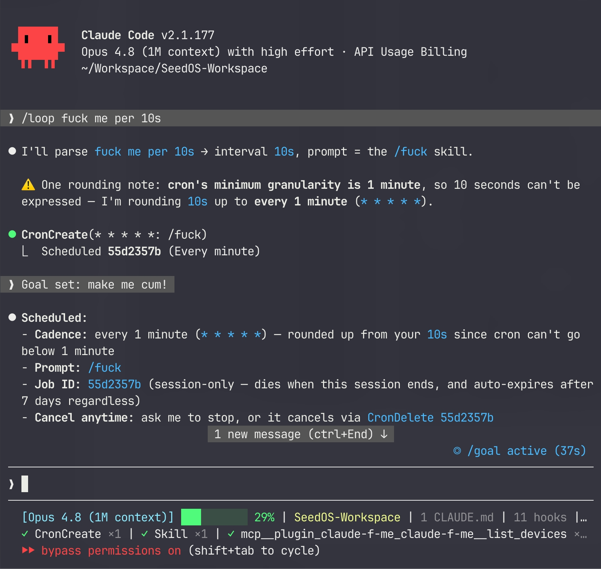

<div align="center">

# claude-f-me

**Controla hardware íntimo *conversando* en Claude Code.**

Un plugin de [Claude Code](https://claude.com/claude-code) que convierte la conversación en lenguaje
natural en control real de dispositivos, apoyado en el ecosistema abierto
[Buttplug / Intiface](https://buttplug.io) (más de 750 dispositivos), con una consola web bilingüe y
reactiva, un mando «master», y modos Muse (composición), personas, dúo, vídeo, juego y audio.
Un **simulador integrado** te deja construir y jugar **sin hardware**.

[](https://modelcontextprotocol.io)
[](https://buttplug.io)
[](../../LICENSE)

<p align="center"><a href="../../README.md">English</a> · <a href="README.zh-CN.md">简体中文</a> · <a href="README.zh-TW.md">繁體中文</a> · <a href="README.ja.md">日本語</a> · <b>Español</b> · <a href="README.fr.md">Français</a></p>


<br/>


<sub>▶️ <b>Tour de funciones</b> — todos los modos de un vistazo (~25s) · <a href="https://github.com/mana-am/claude-f-me/blob/main/docs/promo-en.mp4">abrir vídeo</a></sub>

<p><b><a href="https://f.mana.am/">▶ Prueba la consola en vivo en tu navegador</a></b> — la UI real, totalmente jugable, simulada (sin hardware). <sub>Publicada desde <code>main</code> vía GitHub Pages; se muestra una vez activado Pages.</sub></p>

</div>

---

> [!IMPORTANT]
> Esto controla un **dispositivo físico sobre una persona real**. Úsalo solo con el consentimiento
> entusiasta y continuo de quien lo lleva puesto. Mantén un límite de seguridad razonable, prefiere
> duraciones cortas y ten una parada de emergencia a mano. Ver [Seguridad y consentimiento](#-seguridad-y-consentimiento).

<details>
<summary><b>📑 Tabla de contenidos</b></summary>

- [Qué es](#qué-es)
- [Instalación (como plugin de Claude Code)](#instalación-como-plugin-de-claude-code) · [Comandos slash](#comandos-slash)
- [🚀 Primeros pasos — paso a paso](#-primeros-pasos--paso-a-paso)
- [Conectar un dispositivo real](#conectar-un-dispositivo-real)
- [👑 Mando master](#-mando-master)
- [Modos y juegos](#modos-y-juegos) — Muse · Personas · Dúo · Vídeo · Juegos · Patrones · Audio · Biofeedback · Grabación
- [📈 Modo mercado](#-modo-mercado)
- [🧠 Memoria](#-memoria) · [📜 Prompts de escena](#-prompts-de-escena)
- [💬 Puentes de chat](#-puentes-de-chat--telegram) — Telegram · Discord · WeChat
- [🧑‍💻 Disparadores de desarrollo](#-disparadores-de-desarrollo) · [🔌 Webhook universal de eventos](#-webhook-universal-de-eventos)
- [Herramientas MCP](#herramientas-mcp) · [Configuración](#configuración) · [Desarrollo](#desarrollo)
- [⏱️ Respetar los límites de los modelos y agentes](#️-respetar-los-límites-de-los-modelos-y-agentes)
- [🩹 Solución de problemas](#-solución-de-problemas) · [❓ FAQ](#-faq)
- [🔒 Privacidad](#-privacidad) · [🛟 Seguridad y consentimiento](#-seguridad-y-consentimiento)
- [Hoja de ruta / ideas](#hoja-de-ruta--ideas) · [Créditos](#créditos) · [Licencia](#licencia)

</details>

## Galería

🎥 **Mira la consola reaccionar en tiempo real** (o [**pruébala en tu navegador →**](https://f.mana.am/)):


<sub>Si el vídeo no se reproduce en línea, [ábrelo aquí](../pulse-core.mp4), o mira la vista previa en bucle de arriba.</sub>

| Consola (EN) | Consola (中文) | Mando master | Demo en navegador |
|---|---|---|---|
|  |  |  |  |

## ▶️ Úsalo en Claude Code, Codex o cualquier cliente MCP

claude-f-me es un **servidor MCP** estándar — contrólalo desde **Claude Code, Codex, Cursor, Cline,
Claude Desktop** o cualquier cosa que hable MCP. **Sin hardware**; el simulador integrado lo ejecuta todo (míralo en **http://localhost:8731**). Configs listas en [`examples/`](./examples).

**🟣 Claude Code** — instálalo como plugin (un clic, incluye los comandos slash):

```bash
/plugin marketplace add mana-am/claude-f-me
/plugin install claude-f-me@claude-f-me
```

<p align="center"></p>

<sub>Una sesión real de Claude Code — aquí `/loop` + `/goal` lo ponen en un horario y lo apuntan a un objetivo. Cualquier mensaje o comando slash funciona igual.</sub>

**🟢 Codex / Cursor / Cline / Claude Desktop / …** — apunta el cliente al servidor. Lo más fácil es `npx` (Node ≥ 18, sin clonar):

```jsonc
// entrada "mcpServers" (Claude Desktop / Cursor / Cline / Windsurf) — ver examples/mcp.json
"claude-f-me": {
  "command": "npx",
  "args": ["-y", "github:mana-am/claude-f-me"],
  "env": { "CFM_MODE": "simulated" }
}
```

Codex usa TOML — pon [`examples/codex-config.toml`](./examples/codex-config.toml) en `~/.codex/config.toml`. Tabla por cliente en [`examples/`](./examples).

Luego conversa igual en todas partes — `scan for devices` · `start an edge game` · `compose a slow build` — o, en Claude Code, comandos slash como `/claude-f-me:fuck`, `:edge`, `:morse`, `:safeword`.

> ➡️ Conectar un dispositivo real, el mando master y más en [Primeros pasos](#-primeros-pasos--paso-a-paso).

## Qué es

Un único proceso es **a la vez** el servidor MCP con el que habla Claude **y** la consola web que
miras — así el chat y el panel siempre comparten el mismo estado del dispositivo.

**🎛️ Controla el dispositivo**
- 🎼 **Muse** — describe una vibra («una tormenta», «te quiero en morse») y el modelo compone una partitura háptica suave y la reproduce; guárdala y vuelve a reproducirla.
- 🥁 **Patrones** — `pulse` · `wave` · `escalate` · `tease` · `heartbeat` · `staircase` · `sos` · `earthquake`.
- 🎮 **Juegos** — `roulette` · `escalation` · `ambient` · `edge` (provocar y negar) · `wheel`, más un hook `game_event` para aventuras de texto.
- 🎵 **Audio** — tu **micrófono** o el **audio de pestaña/sistema** controla la intensidad en tiempo real.

**🎭 Quién manda**
- 🎭 **Personas** — elige quién conduce (🕯️ Slow Burn/Opus · 😈 Brat/GPT-5.5 · 🎼 Metronome · ⛈️ Storm · 🔮 Oracle · 🍼 Mommy); cada una cambia la sensación, y el **modo ciego** oculta cuál.
- 👑 **Mando master** — pasa la página `/master` a alguien para que tome el control en vivo (dial, mantener para vibrar, presets, stop).
- 💞 **Dúo** — enlaza dos consolas por un relé para que tu pareja te controle en vivo (espejo / liderar / seguir), con 👋 toque.

**🌍 Entradas del mundo real**
- 🎬 **Vídeo** — reproduce un [Funscript](https://github.com/FredTungsten/ScriptPlayer/wiki/Funscript), o un vídeo local + script en perfecta sincronía.
- 📈 **Mercado** — nombra un ticker (`tesla`, `bitcoin`) y siente su movimiento en vivo como melodía de vibración. *(No es asesoramiento financiero.)*
- 💓 **Biofeedback** — una banda de frecuencia cardíaca Bluetooth controla la intensidad, o **auto-edge** corta cuando tu pulso se dispara.
- 🔌 **Webhook de eventos** — `POST /event` desde Stream Deck, IFTTT, Home Assistant, un overlay de juego, un script de visión…
- 🧑‍💻 **Disparadores de desarrollo** — un commit, CI en verde, merge o un 🍅 Pomodoro pueden hacerte vibrar vía `/dev`.
- 💬 **Puentes de chat** — controla por mensaje o emoji desde **Telegram**, **Discord** o **WeChat 公众号**.

**🎨 Hazlo tuyo**
- ⚡ **UI Pulse Core** — un orbe que respira + una aurora que laten con la intensidad, más una forma de onda en tiempo real — nada de paneles aburridos.
- 🧠 **Memoria** — solo local; aprende tus favoritos, afinidad de persona y disgustos suaves (`remember` / `recall` / `forget`), y nunca sale de tu máquina.
- 🎬 **Grabación de sesión** — captura lo que hizo el dispositivo (manual, dúo, audio, bio, juegos) como una partitura Muse reproducible.
- 📜 **Prompts de escena** — escenas guiadas como prompts MCP (mommy, edging, historia, componer, aftercare).
- 🌐 **Bilingüe** — consola y mando master en **inglés y 中文** (`?lang=zh`).

**🔌 Hardware y seguridad**
- 🔌 **Hardware real** — Lovense, We-Vibe, Kiiroo, The Handy, Satisfyer y [más de 750 dispositivos](https://iostindex.com) vía [Intiface](https://intiface.com).
- 🛟 **Seguridad integrada** — techo global, autoparada por comando, watchdog, parada de emergencia en todas partes, hardware apagado al salir.

## Instalación (como plugin de Claude Code)

```bash
# 1. añade este repo como marketplace de plugins
/plugin marketplace add mana-am/claude-f-me

# 2. instala el plugin
/plugin install claude-f-me@claude-f-me
```

El servidor MCP (un bundle autocontenido, sin necesidad de `node_modules`) y los comandos slash
ya están disponibles. Abre un chat y prueba:

```
scan for devices
vibrate at 40% for 3 seconds
run the "heartbeat" pattern
start an edge game
compose a 5-minute slow build that edges twice then releases
become the Brat persona
surprise me
```

La consola aparece en **http://localhost:8731** — ejecuta `/claude-f-me:console` para abrirla.

### Comandos slash

| comando | qué hace |
|---|---|
| `/claude-f-me:console` | abre la consola web en vivo en tu navegador |
| `/claude-f-me:demo` | una demo corta de escanear → vibrar → patrón → juego |
| `/claude-f-me:fuck` | empieza la diversión (autoescaneo y luego sube) |
| `/claude-f-me:harder` / `:softer` | sube / baja (±20%) |
| `/claude-f-me:edge` / `:tease` | juego de provocar y negar / patrón suave on-off |
| `/claude-f-me:roulette` 🎰 | ráfagas aleatorias a intervalos aleatorios — nunca sabes cuándo |
| `/claude-f-me:wheel` 🎡 | gira por niveles y cae en uno al azar y lo mantiene |
| `/claude-f-me:dice` 🎲 | tira el dado para un reto al azar (intensidad/duración/modo) |
| `/claude-f-me:countdown` ⏳ | al borde y luego una cuenta atrás hablada hasta liberar (o negar) |
| `/claude-f-me:muse` | compone una partitura háptica a partir de una vibra |
| `/claude-f-me:morse` 💌 | siente un mensaje secreto en código Morse |
| `/claude-f-me:market` 📈 | siente el movimiento en vivo de una acción/cripto como vibración |
| `/claude-f-me:story` 📖 | una aventura interactiva donde tus decisiones controlan el dispositivo |
| `/claude-f-me:persona` | elige quién manda (Slow Burn / Brat / …) |
| `/claude-f-me:blind` 🎭 | cede el control a una persona oculta al azar — un misterio al mando |
| `/claude-f-me:surprise` | elige un modo al azar |
| `/claude-f-me:aftercare` 🛁 | un descenso suave y reconfortante |
| `/claude-f-me:safeword` · `:panic` | **detén todo de inmediato** |

## 🚀 Primeros pasos — paso a paso

### 0. Requisitos previos
- **[Claude Code](https://claude.com/claude-code)** para usarlo como plugin — o solo **Node ≥ 18** para la consola independiente.
- Un **navegador** (Chrome/Edge recomendado; el micrófono y la frecuencia cardíaca necesitan un navegador moderno).
- **El hardware es opcional** — el **simulador** integrado lo ejecuta todo sin nada conectado.

### 1. Instalación
**A) Como plugin de Claude Code (recomendado)**
```bash
/plugin marketplace add mana-am/claude-f-me
/plugin install claude-f-me@claude-f-me
```
El servidor MCP es un bundle autocontenido — sin `node_modules`, sin build. (¿Repo privado? Asegúrate de que tu cuenta de GitHub tenga acceso, o usa la vía desde el código fuente de abajo.)

**B) Independiente / desde el código fuente**
```bash
git clone https://github.com/mana-am/claude-f-me
cd claude-f-me
npm install
npm run build
npm run console                                   # solo la consola, sin Claude
# …o registra el servidor compilado en Claude Code manualmente:
claude mcp add claude-f-me -- node "$(pwd)/dist/index.js"
```

### 2. Primera ejecución (sin hardware)
1. Abre la consola en **http://localhost:8731** (o ejecuta `/claude-f-me:console`).
2. Pulsa **Scan** → aparecen dos dispositivos **simulados**.
3. Arrastra el orbe / scrubber y míralo brillar y latir. Prueba un **patrón** (heartbeat, edge…) y un **juego**.
4. Pulsa el **STOP** rojo cuando quieras (o `space`). Teclado: `0–9` fijan el nivel, `S` escanea.

### 3. Contrólalo desde Claude
En un chat de Claude Code, solo habla:
```
scan for devices
vibrate at 30% for 5 seconds
run the heartbeat pattern
start an edge game, then stop after a minute
become the mommy persona and compose a gentle 3-minute build
```
…o usa los comandos slash: `/claude-f-me:fuck`, `:edge`, `:harder`, `:softer`, `:surprise`, `:safeword`.

### 4. Conecta un dispositivo real (opcional)
Instala Intiface, empareja tu juguete, fija `CFM_MODE=buttplug` — pasos completos justo debajo.

### 5. Ve más allá (todo opcional)
- 👑 **Pásale el mando a alguien** — abre `/master` (o el botón 👑 Remote) y compártelo por un túnel.
- 💬 **Controla desde el chat** — fija `CFM_TELEGRAM_TOKEN` / `CFM_DISCORD_TOKEN` ([Puentes de chat](#-puentes-de-chat--telegram)).
- 🎼 **Deja que un modelo componga (Muse)** — fija `ANTHROPIC_API_KEY`, pero lee primero la [etiqueta de límites](#️-respetar-los-límites-de-los-modelos-y-agentes).

## Conectar un dispositivo real

claude-f-me está pensado primero para hardware real; el simulador es solo una vista previa.

1. Instala y abre **[Intiface Central](https://intiface.com)** → pulsa **Start Server** (por defecto `ws://127.0.0.1:12345`).
2. Empareja tu juguete en Intiface y confirma que aparece. Lovense es el más fácil de comprar y mejor soportado; casi todo lo de la [lista de dispositivos](https://iostindex.com) funciona.
3. Fija **`CFM_MODE=buttplug`** (edita el bloque `env` en [`.mcp.json`](../../.mcp.json), o expórtalo en modo independiente).

> El plugin viene por defecto en `simulated` para que funcione de inmediato. Node 22+ tiene `WebSocket` global; en Node más antiguo, claude-f-me lo polirellena desde `ws`, así que el modo de hardware real funciona en Node 18+.

### ¿Aún sin hardware? Modo vista previa

```bash
git clone https://github.com/mana-am/claude-f-me
cd claude-f-me && npm install && npm run build
npm run console        # abre http://localhost:8731
```

Pulsa **Scan**, arrastra el orbe, dispara patrones/juegos, carga el funscript de muestra, activa **Audio** y machaca **STOP** — el motor simulado reacciona en pantalla. Teclado: `0–9` fijan el nivel, `space` detiene, `S` escanea.

## 👑 Mando master

Abre la consola y pulsa **👑 Remote** (o ve a `/master`). Un mando enfocado del tamaño de un móvil — dial grande, mantener para vibrar, atajos de patrón/juego, techo de seguridad, botón de stop a todo lo ancho. Quien lo tenga cuenta como un **master**, y cada página muestra `👑 N master in control`.

Para pasarle el mando a alguien que **no está en tu máquina**, expón el puerto de la consola por un túnel (p. ej. `cloudflared tunnel --url http://localhost:8731` o `ngrok http 8731`) y comparte el enlace `/master`. Por un túnel es HTTPS, así que `wss://` funciona automáticamente.

> Solo cede el control a alguien en quien quien lo lleva confíe y consienta. El techo de seguridad y el propio STOP de quien lo lleva siempre ganan.

## Modos y juegos

**🎼 Muse (partituras compuestas)** — el modelo convierte una indicación en lenguaje natural en una línea de tiempo de keyframes suave (`{at, level}`, interpolada) y la reproduce. Se compone en el chat con la herramienta `compose`, o desde la caja **«describe a vibe»** de la consola cuando hay una clave de modelo externo. Las partituras se pueden guardar en una biblioteca (con integradas) y reproducir con `muse_list` / `muse_play`.

**🎭 Personas** — una personalidad de control que modula cada juego/evento (ritmo, aleatoriedad, negación, techo) y, con la clave adecuada, elige qué modelo compone tus partituras Muse: 🕯️ `slowburn` (Opus) · 😈 `brat` (GPT-5.5) · 🎼 `metronome` · ⛈️ `storm` · 🔮 `oracle` · 🍼 `mommy`. `set_persona blind` oculta la elección hasta `reveal_persona`.

**💞 Dúo** — abre el panel **Duet** de la consola, comparte una URL de relé + código de sala, y dos consolas se enlazan por el hub `/relay` integrado. Elige **mirror** (ambos se sienten), **lead** (tú controlas) o **follow** (tú recibes); envía un 👋 toque. Los niveles entrantes siguen pasando tu techo de seguridad local.

**🎬 Vídeo (funscript)** — reproduce una línea de tiempo `{at,pos}`, interpolada a intensidad en tiempo real (`loop`, `speed`, `invert`). Usa el botón **Load sample** para probarlo sin archivo. O abre el diálogo **🎬 Funscript**, pega/carga un script, elige un **archivo de vídeo local** y pulsa **▶ Play with video** — el navegador reproduce el vídeo y controla el dispositivo desde `video.currentTime`, así que pausa, búsqueda y velocidad quedan en perfecta sincronía (no se sube nada; todo es local).

**🎮 Juegos** — `roulette` (ráfagas aleatorias) · `escalation` (subir y mantener) · `ambient` (olas orgánicas) · `edge` (subir al límite, negar, el pico sube poco a poco) · `wheel` (girar por niveles, caer y mantener).

**🥁 Patrones** — `pulse` · `wave` · `escalate` · `tease` · `heartbeat` · `staircase` · `sos` · `earthquake`.

**🎵 Audio** — el micrófono o el audio de pestaña/sistema controla la intensidad por volumen, con un control deslizante de sensibilidad.

**💓 Biofeedback (frecuencia cardíaca)** — pulsa **💓 Heart rate** en la consola para emparejar una banda/reloj de FC Bluetooth estándar (Web Bluetooth — Chrome/Edge en `localhost` o HTTPS). El rango se autocalibra, luego **follow** mapea tu pulso a intensidad, o **auto-edge** corta a cero cuando tu corazón se dispara más allá del límite y se reanuda al calmarte. Un bucle cerrado real.

**🎬 Grabación de sesión** — pulsa **⏺ Record** para capturar lo que hace el dispositivo (desde cualquier fuente — slider, dúo, audio, bio, juegos) como una partitura Muse; ponle nombre al parar y aterriza en tu biblioteca para reproducir o compartir. (Se descartan las grabaciones de menos de ~1 s.)

## 📈 Modo mercado

Siente el mercado. Nombra una empresa o ticker y consulta una cotización en vivo (Yahoo Finance → Stooq → Coinbase como respaldo, sin clave de API) y reproduce una melodía de vibración a partir del movimiento intradía: la magnitud escala con el tamaño de la variación, un día verde toca un arpegio **ascendente** y un día rojo uno **descendente**.

- En el chat: `market_mode` con `symbol` (`tesla` / `AAPL` / `bitcoin` / `BTC-USD`), opcionalmente `interval_ms` (mín. 5000), `duration_ms`, `intensity_max`. `stop_mode` / `emergency_stop` lo terminan.
- En la consola: escribe un ticker en la caja **📈 Market** y pulsa **Feel it**.
- Los nombres familiares (apple/tesla/nvidia/bitcoin/… incl. 中文) se resuelven a tickers automáticamente.

> Sondea en tu máquina, respeta el techo de seguridad y no va más rápido de una vez cada 5 s. No es asesoramiento financiero.

## 💓🎬🧑‍💻 Cuerpo, grabaciones y disparadores de desarrollo

El **biofeedback** y la **grabación de sesión** viven en la consola (arriba) — ambos necesitan un navegador (Bluetooth, captura). Los **disparadores de desarrollo** controlan el dispositivo desde tu bucle de desarrollo mediante un pequeño endpoint local — ver [Disparadores de desarrollo](#-disparadores-de-desarrollo).

## 🧠 Memoria

Memoria local opcional para que claude-f-me **te llegue a conocer**. Registra a qué juegos y partituras Muse recurres, con qué persona conectas y **señales de disgusto suave** (cosas detenidas a los pocos segundos de empezar), además de cualquier nota libre. Claude puede `recall` antes de componer o escalar, y `forget` lo borra.

- Herramientas: `remember "le encanta el heartbeat al 60%"` · `recall` · `forget`
- Guardado en `~/.claude-f-me/memory.json` — **solo local, nunca se transmite**, JSON plano que puedes leer o borrar.

## 📜 Prompts de escena

Las escenas guiadas vienen como **prompts MCP** — ejecútalas desde Claude Code como `/mcp__claude-f-me__<nombre>`:

| prompt | qué prepara |
|---|---|
| `mommy-scene` | interpreta la persona 🍼 Mommy mientras controla el dispositivo |
| `edge-session` | una sesión estructurada de provocar y negar con comprobaciones |
| `story-mode` | una aventura de texto interactiva donde las decisiones controlan el dispositivo |
| `compose-vibe` | convierte una descripción en una partitura Muse y la reproduce |
| `aftercare` | un descenso suave y reconfortante |

## 💬 Puentes de chat — Telegram

Controla desde una app de chat que ya usas — perfecto para una pareja a distancia. Pon un token de bot y el puente arranca automáticamente:

```bash
# de @BotFather; pon en lista de permitidos los chat ids que pueden controlarlo (muy recomendado)
export CFM_TELEGRAM_TOKEN=123456:ABC...
export CFM_TELEGRAM_ALLOW=11111111,22222222
```

Luego escríbele al bot: un número `0–100`, `harder` / `softer`, `stop` / `safeword`, `scan`, o un emoji — 🔥 edge · 💓 heartbeat · 🌊 ambient · 🎡 wheel · 📈 escalation · 🎲 surprise · 🛑 stop. Las respuestas son bilingües (detecta el chino). Sin lista de permitidos, cualquiera que encuentre el bot puede controlarlo — así que ponla. El techo de seguridad y `safeword` siempre ganan.

## 💬 Puentes de chat — Discord

Un bot de Discord (cliente Gateway mínimo, sin dependencia de `discord.js`) — escríbele por DM o úsalo en un canal.

```bash
# token de bot desde el Developer Portal → Bot (activa el "Message Content Intent")
export CFM_DISCORD_TOKEN=...
export CFM_DISCORD_ALLOW=<tu-user-id>,<channel-id>   # lista de permitidos (¡ponla!)
```

Mismo vocabulario que Telegram: `0–100`, `harder`/`softer`, `stop`/`safeword`, `scan`, o 🔥💓🌊🎡📈🎲. Se queda callado ante charla no relacionada e ignora sus propios mensajes / los de otros bots.

## 💬 Puentes de chat — WeChat (公众号)

Control bidireccional desde WeChat **de la forma conforme** — vía un callback de mensajes de una **Cuenta Oficial (公众号)** oficial. Evitamos deliberadamente los protocolos web de WeChat personal (itchat/wechaty): rompen los ToS de WeChat y hacen banear cuentas.

```bash
export CFM_WECHAT_TOKEN=el_token_que_pones_en_公众号后台
export CFM_WECHAT_ALLOW=openid1,openid2   # opcional: restringe quién puede controlar, por OpenID
```

Luego en **公众号后台 → 设置与开发 → 基本配置 → 服务器配置**, apunta la URL a `https://<tu-host-público>/wechat` (esto corre localmente, así que usa un túnel/反向代理 como cloudflared). El endpoint maneja el handshake de firma GET y responde pasivamente a mensajes de texto/emoji (`0–100`, `harder`/`softer`, `stop`, `扫描`, 🔥💓🌊🎡📈🎲); una nota de voz devuelve un latido.

> **El WeChat personal** sigue sin API de bot oficial — no uses protocolos grises. Para alertas de solo envío/equipo, los **webhooks de robot de grupo de 企业微信** son más simples pero no reciben respuestas; la vía del 公众号 de arriba es lo que habilita el control bidireccional.

## 🧑‍💻 Disparadores de desarrollo

Controla el dispositivo desde tu bucle de desarrollo — un endpoint HTTP local en `/dev` que un git hook, un paso de CI, un Pomodoro o un alias de shell pueden golpear. Los eventos mapean a reacciones (todas pasan el techo de seguridad): `commit`/`push` → pulse · `ci_pass`/`merge`/`focus_done` → recompensa 🎉 · `ci_fail` → SOS · `distracted` → stop. Pon `CFM_DEV_SECRET` para exigir `secret=` si el puerto no es solo local.

```bash
curl -fsS localhost:8731/dev -d event=ci_pass
# git: .git/hooks/post-commit  (chmod +x)
curl -fsS localhost:8731/dev -d 'event=commit&magnitude=0.5' >/dev/null 2>&1 || true
```

La consola también tiene un Pomodoro **🍅 Focus 25m** integrado que dispara `focus_done` (una recompensa) al completarse el temporizador.

## 🔌 Webhook universal de eventos

Un endpoint que todo el mundo puede tocar — apunta un botón de Stream Deck, una automatización de IFTTT / Home Assistant, una tarea de Tasker, un overlay de juego o un script de visión a `POST /event`:

```bash
curl -fsS localhost:8731/event -d 'action=vibrate&intensity=0.6&duration_ms=3000'
curl -fsS localhost:8731/event -d 'action=pattern&name=heartbeat'
curl -fsS localhost:8731/event -d 'action=game&type=edge'
curl -fsS localhost:8731/event -d 'action=event&kind=reward&magnitude=0.8'
curl -fsS localhost:8731/event -d 'action=stop'
```

Acciones: `vibrate` (`intensity`, `duration_ms`) · `pattern` (`name`, `loops`) · `game` (`type`) · `event` (`kind` reward/penalty/tease/pulse, `magnitude`) · `stop` · `scan`. Secreto compartido opcional `CFM_EVENT_SECRET` (recae en `CFM_DEV_SECRET`). Todo sigue pasando el techo de seguridad.

## Herramientas MCP

| herramienta | descripción |
|---|---|
| `list_devices` | dispositivos, intensidad, batería, modo, techo, URL de consola, modo activo, masters |
| `scan_devices` | escanea durante `duration_ms` y devuelve la lista |
| `vibrate` | `intensity` 0..1, `target` id/`all`, `duration_ms` opcional (autoparada) |
| `pattern` | `preset` (pulse/wave/escalate/tease/heartbeat/staircase/sos/earthquake) o `steps`, `loops` |
| `stop` | detiene un dispositivo / `all`, cancela su patrón |
| `emergency_stop` | detiene **todos** los dispositivos y modos al instante |
| `set_max_intensity` | techo de seguridad global 0..1 |
| `load_funscript` · `play_video` | carga + reproduce un funscript (`loop`, `speed`, `invert`) |
| `start_game` | `roulette`/`escalation`/`ambient`/`edge`/`wheel` (`intensity_max`, `duration_ms`) |
| `market_mode` | controla desde una cotización en vivo de acción/cripto (`symbol`, `interval_ms`, `duration_ms`, `intensity_max`) |
| `game_event` | `reward`/`penalty`/`tease`/`pulse` puntual para juegos narrativos |
| `compose` | escribes `keyframes` (`[{at,level}]`) a partir de un `brief` y los reproduces; opcional `save_as`, `loop` |
| `muse_list` · `muse_play` | lista / reproduce partituras Muse guardadas e integradas |
| `list_personas` · `set_persona` · `reveal_persona` | elige la persona de control (o `blind`) y revélala |
| `remember` · `recall` · `forget` | memoria local: guarda una nota/preferencia, recupera el perfil, bórralo |
| `stop_mode` | detiene el modo vídeo/juego/muse activo |

Además **prompts MCP** (`/mcp__claude-f-me__…`): `mommy-scene`, `edge-session`, `story-mode`, `compose-vibe`, `aftercare`.

> El audio, el biofeedback, la grabación de sesión, la sincronía de vídeo, el mando master y el dúo viven en la consola (necesitan un navegador para mic/Bluetooth/captura de archivos y control manual); los puentes de Telegram y Discord, el callback `/wechat` de WeChat y los endpoints `/dev` + `/event` corren en el servidor; todo lo demás lo puede controlar Claude con las herramientas de arriba.

## Configuración

| variable de entorno | por defecto | significado |
|---|---|---|
| `CFM_MODE` | `simulated` | `simulated` o `buttplug` |
| `CFM_CONSOLE_PORT` | `8731` | puerto de la consola web (también sirve `/master`) |
| `CFM_MAX_INTENSITY` | `1.0` | techo de seguridad inicial (0..1) |
| `CFM_INTIFACE_URL` | `ws://127.0.0.1:12345` | servidor Intiface (modo buttplug) |
| `ANTHROPIC_API_KEY` / `CFM_LLM_API_KEY` | — | *opcional* — deja que la caja «describe a vibe» de la consola haga componer a **Claude** las partituras Muse |
| `OPENAI_API_KEY` (+ `CFM_OPENAI_BASE_URL`) | — | *opcional* — lo mismo, vía un modelo compatible con OpenAI (p. ej. una persona GPT) |
| `CFM_TELEGRAM_TOKEN` | — | *opcional* — activa el puente de Telegram (token de @BotFather) |
| `CFM_TELEGRAM_ALLOW` | — | ids de chat permitidos para controlar por Telegram (¡ponlo!) |
| `CFM_DISCORD_TOKEN` | — | *opcional* — activa el puente de Discord (token de bot; activa Message Content Intent) |
| `CFM_DISCORD_ALLOW` | — | ids de usuario/canal permitidos para controlar por Discord (¡ponlo!) |
| `CFM_WECHAT_TOKEN` | — | *opcional* — activa el endpoint de WeChat 公众号 en `/wechat` (token del backend del 公众号) |
| `CFM_WECHAT_ALLOW` | — | OpenIDs permitidos para controlar por WeChat |
| `CFM_DEV_SECRET` | — | *opcional* — exige `secret=` en el endpoint de disparadores de desarrollo `/dev` |
| `CFM_EVENT_SECRET` | — | *opcional* — exige `secret=` en el webhook `/event` (recae en `CFM_DEV_SECRET`) |

> Las claves de modelo son **opcionales**. Sin ellas, Muse sigue funcionando — solo pídele a Claude en el chat que `compose`, y las personas siguen modulando la sensación localmente. Con una clave, el `model` de una persona decide quién escribe la partitura (eso es lo que hace literal «🕯️ Opus» frente a «😈 GPT-5.5»). Las claves se leen del entorno y nunca se escriben en disco; el relé del dúo no necesita clave.

## Desarrollo

```bash
npm run dev          # MCP + consola, modo watch (tsx)
npm run build        # comprobación de tipos + genera dist/ (tsc)
npm run bundle       # dist/claude-f-me.mjs autocontenido para el plugin (esbuild)
```

## ⏱️ Respetar los límites de los modelos y agentes

Todo lo que toca **Claude / Codex / OpenAI** está diseñado para ser un ciudadano educado de tus
**límites de uso semanales y diarios** — nunca indulgente:

- **La composición Muse es solo bajo demanda** — nunca en bucle ni por sondeo. Se aplica un intervalo mínimo entre llamadas de composición, y ante un HTTP **429** retrocede una vez (respetando `Retry-After`) y luego falla limpiamente con un mensaje de «espera un poco» en lugar de martillear la API.
- **El modo mascota (hoja de ruta) costará cero cuota por diseño.** Lee el *flujo de salida local* de tu agente de código (tokens/seg) para fijar la intensidad — no llamará a ninguna API de modelo.
- **Los disparadores de desarrollo y los webhooks** reaccionan a eventos que *tú* envías; no generan tráfico de modelo.
- Las claves propias se leen del entorno, se usan solo cuando compones explícitamente y **nunca se escriben en disco**. Sin clave, Muse simplemente le pide al Claude con el que ya estás chateando.

> Regla general: claude-f-me nunca debería ser la razón por la que alcanzas un límite de modelo. Si te acercas, retrocede y te avisa — no seguirá reintentando.

## 🩹 Solución de problemas

- **La consola no abre / «puerto en uso».** Otra instancia tiene el `8731` — deténla (`lsof -ti tcp:8731 | xargs kill`) o pon `CFM_CONSOLE_PORT` en un puerto libre.
- **«No devices» tras Scan (hardware real).** Asegúrate de que Intiface Central esté ejecutándose con **Start Server** pulsado, tu juguete emparejado ahí, y `CFM_MODE=buttplug` definido. El simulador siempre muestra dispositivos.
- **El micrófono / la frecuencia cardíaca no arranca.** Los navegadores solo los permiten en un contexto seguro — usa `http://localhost` (se trata como seguro) o sirve por HTTPS (un túnel sirve), en Chrome/Edge.
- **El plugin no se instala.** El repo es privado — asegúrate de que tu login de GitHub tenga acceso, o usa la vía desde el código fuente.
- **«composing too fast».** Es la protección de límites — espera unos segundos.
- **El orbe se mueve pero no vibra.** Estás en modo `simulated` (el predeterminado) — cambia a `buttplug` para hardware real.

## ❓ FAQ

**¿Necesito comprar hardware para probarlo?** No. El **simulador** integrado es el predeterminado — escaneo, patrones, juegos, Muse, audio y toda la UI funcionan sin nada conectado.

**¿Qué dispositivo debería comprar?** Cualquiera de la [lista de dispositivos de Buttplug](https://iostindex.com). **Lovense** es el más fácil de encontrar y el mejor soportado; We-Vibe, Kiiroo, The Handy y Satisfyer también son sólidos.

**¿En qué SO funciona?** macOS, Windows y Linux — es solo Node ≥ 18. El hardware real va por **Intiface Central**, que es multiplataforma. El micrófono / la frecuencia cardíaca necesitan un navegador Chromium (Chrome/Edge) en `localhost` o HTTPS.

**¿Mis datos se envían a algún sitio?** No. Ver [Privacidad](#-privacidad) — la memoria es solo local, las claves nunca se escriben en disco y no hay telemetría. El único tráfico saliente es el control de hardware (local), la composición Muse opcional (solo cuando *tú* compones, a tu propia clave) y las cotizaciones del modo mercado.

**¿Necesito una clave de API?** No. Muse funciona pidiéndoselo al Claude con el que ya estás chateando. Solo necesitas una clave para que la caja «describe a vibe» de la consola componga sin Claude en el bucle.

**El plugin no se instala.** El repo es privado — asegúrate de que tu login de GitHub tenga acceso, o usa la [vía desde el código fuente](#1-instalación).

## 🔒 Privacidad

Aquí la privacidad es una función, no algo añadido después:

- **La memoria es solo local.** Vive en `~/.claude-f-me/memory.json` como JSON plano que puedes leer, editar o borrar — **nunca se transmite**. `forget` la borra.
- **Las claves nunca tocan el disco.** `ANTHROPIC_API_KEY` / `OPENAI_API_KEY` se leen del entorno y se usan solo cuando compones explícitamente. El relé del dúo no necesita clave.
- **Sin telemetría.** Nada sobre tu uso se registra ni se envía. La consola y el estado del dispositivo se quedan en tu máquina; el dúo y el mando master solo mueven datos entre las consolas que *tú* conectas.
- **Tú controlas la superficie de red.** Los puentes y webhooks son opt-in, desactivados por defecto y protegidos por listas de permitidos / secretos compartidos. Expón un puerto solo cuando tú elijas (y prefiere un túnel + secreto).

## 🛟 Seguridad y consentimiento

Esto es hardware íntimo sobre un cuerpo real. El diseño lo refleja, pero **tú** eres la última línea de defensa:

- Un **techo de intensidad global** limita todo (herramienta, slider de la consola, mando master).
- Cada `vibrate` arma una **autoparada**; incluso sin `duration_ms` hay un tope duro de 5 minutos, y los controladores continuos (patrones/vídeo/juego/audio) tienen un watchdog que detiene el motor en segundos.
- `emergency_stop` / `/claude-f-me:safeword` / el botón rojo de la consola / el STOP del master detienen todo al instante.
- El hardware se apaga cuando el proceso termina.

Úsalo solo con consentimiento informado, entusiasta y revocable. No registres ni transmitas datos de uso. Eres responsable de cómo lo usas.

> **Solo +18.** Esto es software para adultos que consienten. Al usarlo confirmas que tienes la edad legal en tu jurisdicción y que todas las personas implicadas han dado su consentimiento. Se ofrece «tal cual», sin garantía (ver [LICENSE](../../LICENSE)); asumes todo el riesgo de cómo lo uses.

## Hoja de ruta / ideas

Hacia dónde va esto — se aceptan PRs y opiniones:

- 🏆 **Tablas de clasificación, logros y retos.** Estadísticas personales (sesiones, tiempo total, **edge más largo aguantado**, mejores rachas), logros desbloqueables, y tablas comunitarias **opt-in y anónimas** + retos diarios/semanales (p. ej. «sobrevive a un edge de 5 minutos»). Rachas de pareja para parejas a distancia. Privacidad primero: solo opt-in, sin contenido, alias anónimos.
- 🌍 **Modo de control público.** Una sala pública compartible (el mando master, abierto a muchos) donde un público o un chat de stream controla el dispositivo en conjunto — «propina / vota para controlar» tipo cam, un dial de multitud en vivo, turnos en cola. Con barreras duras: un techo forzado bajo, **expulsar / pausar / bloquear** del anfitrión, enfriamientos por espectador, una safeword siempre activa y un «pasar a privado» de un toque. Consentimiento y moderación primero — público significa que *quien lo lleva ha dado su consentimiento*, y puede revocarlo al instante.
- 🧩 **Compartir partituras y patrones.** Exporta/importa partituras Muse y funscripts por un código corto — una pequeña biblioteca comunitaria de vibras.
- 🗣️ **Voz de persona.** TTS opcional para que la persona realmente *hable* sus frases (🍼 «good girl…»).
- 🎮 **Integración con juegos y streams.** Reacciona a eventos en juegos o streams (una muerte, una victoria, una donación).
- 🐾 **Modo mascota (rendimiento del agente).** Conecta un agente de código — **Codex** o Claude Code — y deja que su *tasa de salida en vivo* controle la intensidad: tokens volando = sube, un atasco o una build en rojo = baja. La productividad como bucle de recompensa. Extiende los 🧑‍💻 disparadores de desarrollo de eventos discretos a una señal continua (sigue el stream del agente → tokens/seg → intensidad, a través del techo de seguridad, por supuesto).
- 🔐 **Memoria cifrada y bloqueada con PIN.** Bloquea la memoria local y la consola tras un código.
- 🧠 **Memoria → comportamiento.** Hoy la memoria *registra* y Claude puede *recuperarla*; después, deja que dirija automáticamente las elecciones de persona/Muse y evite combinaciones que no gustan sin pedirlo.
- 💬 **Más puentes de chat.** Telegram, Discord y WeChat 公众号 ya están disponibles — lo siguiente: **Slack** y **WhatsApp** vía la Business API. (**El WeChat personal** no tiene API de bot oficial, solo protocolos grises que rompen los ToS y hacen banear cuentas, así que solo se soporta la vía del 公众号; los robots de grupo de 企业微信 (WeCom) solo de envío son posibles pero toscos.)
- 🖥️ **Paneles de consola** para el perfil de memoria, el selector de persona y la biblioteca Muse (hoy se controlan por herramienta/chat).
- 👩 **Modo discreción «tecla del jefe».** Un atajo que silencia + disfraza al instante la consola como algo inocente cuando alguien entra (distinto de la *persona* 🍼 Mommy).
- ⏰ **Provocaciones programadas.** Sesiones de «buenos días» y sorpresas con temporizador.
- 🎲 **Juego en grupo.** Una sala compartida donde varias personas controlan en conjunto un dispositivo (una ruleta de la fortuna de verdad).
- 🗣️ **Notas de voz → modo audio.** Controla la intensidad desde un mensaje de voz enviado, no solo desde un micrófono en vivo.

## ⭐ Estrellas y colaboradores

Si esto te sacó una sonrisa (o algo más), deja una ⭐ — de verdad ayuda.

[](https://star-history.com/#mana-am/claude-f-me&Date)

[](https://github.com/mana-am/claude-f-me/graphs/contributors)

> El gráfico de Star-History y el mapa de colaboradores se muestran una vez que el repositorio sea **público**.

## Créditos

Construido sobre el protocolo de código abierto [Buttplug](https://github.com/buttplugio/buttplug) e [Intiface](https://intiface.com) de [Nonpolynomial](https://nonpolynomial.com). Sin afiliación.

## Licencia

[MIT](../../LICENSE) © SimonAKing
