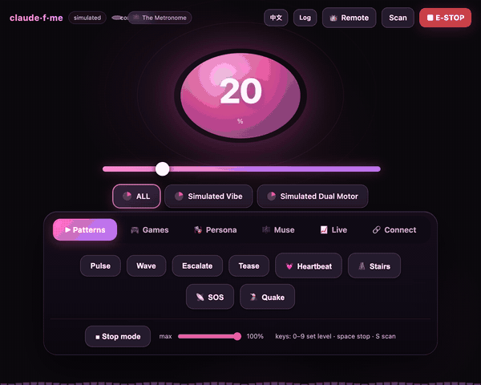
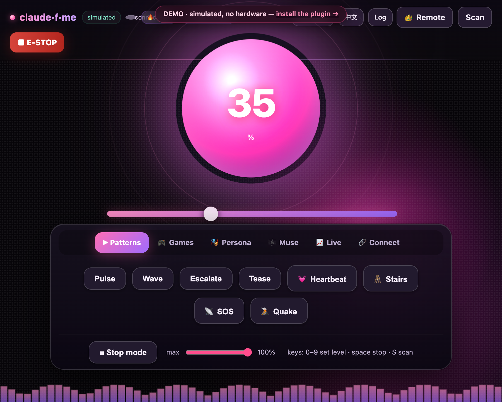

<div align="center">

# claude-f-me

**Contrôlez du matériel intime en *discutant* dans Claude Code.**

Un plugin [Claude Code](https://claude.com/claude-code) installable qui transforme la conversation en
langage naturel en contrôle réel d'appareils — adossé à l'écosystème ouvert
[Buttplug / Intiface](https://buttplug.io) (plus de 750 appareils compatibles), avec une console web
bilingue et réactive, une télécommande master, et des modes vidéo (funscript), jeu et audio.
Un **simulateur intégré** permet de tout construire et d'essayer **sans matériel**.

[](https://modelcontextprotocol.io)
[](https://buttplug.io)
[](../../LICENSE)
[](https://nodejs.org)
[](https://github.com/mana-am/claude-f-me/stargazers)
[](https://github.com/mana-am/claude-f-me/commits)

<p align="center"><a href="../../README.md">English</a> · <a href="README.zh-CN.md">简体中文</a> · <a href="README.zh-TW.md">繁體中文</a> · <a href="README.ja.md">日本語</a> · <a href="README.es.md">Español</a> · <b>Français</b></p>



<p><b><a href="https://pages.mana.am/">▶ Essaie la console en direct dans ton navigateur</a></b> — la vraie UI, entièrement jouable, simulée (sans matériel). <sub>Publiée depuis <code>main</code> via GitHub Pages ; s'affiche une fois Pages activé.</sub></p>

</div>

---

> [!IMPORTANT]
> Ceci contrôle un **appareil physique sur une personne réelle**. À n'utiliser qu'avec le
> consentement enthousiaste et continu de la personne qui le porte. Gardez un plafond de sécurité
> raisonnable, privilégiez les durées courtes et gardez un arrêt d'urgence à portée de main.
> Voir [Sécurité et consentement](#-sécurité-et-consentement).

<details>
<summary><b>📑 Table des matières</b></summary>

- [Qu'est-ce que c'est](#quest-ce-que-cest)
- [Installation (en tant que plugin Claude Code)](#installation-en-tant-que-plugin-claude-code) · [Commandes slash](#commandes-slash)
- [🚀 Démarrage — étape par étape](#-démarrage--étape-par-étape)
- [Connecter un appareil réel](#connecter-un-appareil-réel)
- [👑 Télécommande master](#-télécommande-master)
- [Modes et jeux](#modes-et-jeux) — Muse · Personas · Duo · Vidéo · Jeux · Motifs · Audio · Biofeedback · Enregistrement
- [📈 Mode marché](#-mode-marché)
- [🧠 Mémoire](#-mémoire) · [📜 Prompts de scène](#-prompts-de-scène)
- [💬 Ponts de chat](#-ponts-de-chat--telegram) — Telegram · Discord · WeChat
- [🧑‍💻 Déclencheurs développeur](#-déclencheurs-développeur) · [🔌 Webhook d'événement universel](#-webhook-dévénement-universel)
- [Outils MCP](#outils-mcp) · [Configuration](#configuration) · [Développement](#développement)
- [⏱️ Respecter les limites de débit des modèles et agents](#️-respecter-les-limites-de-débit-des-modèles-et-agents)
- [🩹 Dépannage](#-dépannage) · [❓ FAQ](#-faq)
- [🔒 Confidentialité](#-confidentialité) · [🛟 Sécurité et consentement](#-sécurité-et-consentement)
- [Feuille de route / idées](#feuille-de-route--idées) · [Crédits](#crédits) · [Licence](#licence)

</details>

## Galerie

🎥 **Regarde la console réagir en temps réel** (ou [**essaie-la dans ton navigateur →**](https://pages.mana.am/)) :

<video src="https://github.com/mana-am/claude-f-me/raw/main/docs/pulse-core.mp4" width="640" controls></video>

<sub>Si la vidéo ne se lit pas en ligne, [ouvre-la ici](../pulse-core.mp4), ou regarde l'aperçu en boucle en haut.</sub>

| Console (EN) | Console (中文) | Télécommande master | Démo navigateur |
|---|---|---|---|
|  |  |  |  |

## Qu'est-ce que c'est

```
  ┌──────────────┐   MCP (stdio)    ┌───────────────────────────┐
  │  Claude Code │ ───────────────► │        claude-f-me        │
  └──────────────┘                  │  (one process)            │
  ┌──────────────┐   WebSocket      │   ┌─────────────────────┐ │
  │  Web console │ ◄──────────────► │   │   DeviceManager     │ │  safety cap · watchdog
  │  + master    │                  │   │   ModeController    │ │  patterns · video · game
  │  + duet      │                  │   │   muse · personas   │ │  muse · personas · duet
  └──────────────┘                  │   └──────────┬──────────┘ │
                                    └──────────────┼────────────┘
                                       ┌───────────┴───────────┐
                                       ▼                       ▼
                              buttplug backend          simulated backend
                          → Intiface → real toy         (preview, no hardware)
```

Un seul processus est **à la fois** le serveur MCP auquel Claude parle **et** la console web que vous
regardez — le chat et le tableau de bord partagent donc toujours le même état d'appareil.

**🎛️ Piloter l'appareil**
- 🎼 **Muse** — décrivez une ambiance (« un orage », « je t'aime en morse ») et le modèle compose une partition haptique fluide et la joue ; sauvegardez et rejouez.
- 🥁 **Motifs** — `pulse` · `wave` · `escalate` · `tease` · `heartbeat` · `staircase` · `sos` · `earthquake`.
- 🎮 **Jeux** — `roulette` · `escalation` · `ambient` · `edge` (taquiner-refuser) · `wheel`, plus un hook `game_event` pour les aventures textuelles.
- 🎵 **Audio** — votre **micro** ou l'**audio d'onglet/système** pilote l'intensité en temps réel.

**🎭 Qui commande**
- 🎭 **Personas** — choisissez qui pilote (🕯️ Slow Burn/Opus · 😈 Brat/GPT-5.5 · 🎼 Metronome · ⛈️ Storm · 🔮 Oracle · 🍼 Mommy) ; chacune change le ressenti, et le **mode aveugle** cache laquelle.
- 👑 **Télécommande master** — confiez la page `/master` à quelqu'un pour prendre le contrôle en direct (cadran, maintien, presets, stop).
- 💞 **Duo** — reliez deux consoles via un relais pour qu'un partenaire vous pilote en direct (miroir / mener / suivre), avec toucher 👋.

**🌍 Entrées du monde réel**
- 🎬 **Vidéo** — lisez un [Funscript](https://github.com/FredTungsten/ScriptPlayer/wiki/Funscript), ou une vidéo locale + script en parfaite synchro.
- 📈 **Marché** — nommez un ticker (`tesla`, `bitcoin`) et ressentez son mouvement en direct comme une mélodie de vibrations. *(Pas un conseil financier.)*
- 💓 **Biofeedback** — une ceinture cardiaque Bluetooth pilote l'intensité, ou **auto-edge** coupe quand votre pouls s'emballe.
- 🔌 **Webhook d'événement** — `POST /event` depuis Stream Deck, IFTTT, Home Assistant, une superposition de jeu, un script CV…
- 🧑‍💻 **Déclencheurs développeur** — un commit, un CI passant, un merge ou un 🍅 Pomodoro peut vous faire vibrer via `/dev`.
- 💬 **Ponts de chat** — contrôlez par message ou emoji depuis **Telegram**, **Discord** ou **WeChat 公众号**.

**🎨 À votre image**
- ⚡ **UI Pulse Core** — un orbe qui respire + une aurore qui pulsent avec l'intensité, plus une forme d'onde en temps réel — pas un banal tableau de bord.
- 🧠 **Mémoire** — locale uniquement ; apprend vos favoris, affinité de persona et rejets doux (`remember` / `recall` / `forget`), et ne quitte jamais votre machine.
- 🎬 **Enregistrement de séance** — capturez ce que l'appareil a fait (manuel, Duo, audio, bio, jeux) en partition Muse rejouable.
- 📜 **Prompts de scène** — scènes guidées en prompts MCP (mommy, edging, histoire, composer, aftercare).
- 🌐 **Bilingue** — console et télécommande en **anglais et 中文** (`?lang=zh`).

**🔌 Matériel et sécurité**
- 🔌 **Matériel réel** — Lovense, We-Vibe, Kiiroo, The Handy, Satisfyer et [750+ appareils](https://iostindex.com) via [Intiface](https://intiface.com).
- 🛟 **Sécurité intégrée** — plafond global, arrêt auto par commande, watchdog, arrêt d'urgence partout, extinction à la sortie.

## Installation (en tant que plugin Claude Code)

```bash
# 1. ajoutez ce dépôt comme marketplace de plugins
/plugin marketplace add mana-am/claude-f-me

# 2. installez le plugin
/plugin install claude-f-me@claude-f-me
```

Le serveur MCP (un bundle autonome, sans `node_modules`) et les commandes slash sont
maintenant disponibles. Ouvrez un chat et essayez :

```
scan for devices
vibrate at 40% for 3 seconds
run the "heartbeat" pattern
start an edge game
compose a 5-minute slow build that edges twice then releases
become the Brat persona
surprise me
```

La console est accessible sur **http://localhost:8731** — lancez `/claude-f-me:console` pour l'ouvrir.

### Commandes slash

| commande | effet |
|---|---|
| `/claude-f-me:console` | ouvre la console web en direct dans le navigateur |
| `/claude-f-me:demo` | démo courte : scan → vibration → motif → jeu |
| `/claude-f-me:fuck` | démarre (scan auto, puis montée en puissance) |
| `/claude-f-me:harder` | augmenter (+20%) |
| `/claude-f-me:softer` | diminuer (−20%) |
| `/claude-f-me:edge` | jeu de taquiner-refuser |
| `/claude-f-me:tease` | motif doux en va-et-vient |
| `/claude-f-me:roulette` 🎰 | salves aléatoires à intervalles aléatoires — on ne sait jamais quand |
| `/claude-f-me:wheel` 🎡 | tourne à travers les niveaux puis s'arrête sur un niveau au hasard |
| `/claude-f-me:dice` 🎲 | lance le dé pour un gage aléatoire (intensité/durée/mode) |
| `/claude-f-me:countdown` ⏳ | au bord, puis un compte à rebours parlé jusqu'à la libération (ou le refus) |
| `/claude-f-me:muse` | composer une partition haptique depuis une ambiance |
| `/claude-f-me:morse` 💌 | ressentir un message secret en code Morse |
| `/claude-f-me:market` 📈 | ressentir le mouvement en direct d'une action/crypto en vibration |
| `/claude-f-me:story` 📖 | une aventure interactive où tes choix pilotent l'appareil |
| `/claude-f-me:persona` | choisir qui commande (Slow Burn / Brat / …) |
| `/claude-f-me:blind` 🎭 | confie le contrôle à une persona cachée au hasard — un mystère aux commandes |
| `/claude-f-me:surprise` | choisir un mode au hasard |
| `/claude-f-me:aftercare` 🛁 | une fin de séance douce et réconfortante |
| `/claude-f-me:safeword` · `/claude-f-me:panic` | **tout arrêter immédiatement** |

## 🚀 Démarrage — étape par étape

### 0. Prérequis
- **[Claude Code](https://claude.com/claude-code)** pour l'utiliser en tant que plugin — ou simplement **Node ≥ 18** pour la console autonome.
- Un **navigateur** (Chrome/Edge recommandé ; les fonctions micro et fréquence cardiaque nécessitent un navigateur moderne).
- **Le matériel est optionnel** — le **simulateur** intégré fait tout fonctionner sans rien brancher.

### 1. Installation

**A) En tant que plugin Claude Code (recommandé)**

```bash
/plugin marketplace add mana-am/claude-f-me
/plugin install claude-f-me@claude-f-me
```

Le serveur MCP est un bundle autonome — pas de `node_modules`, pas de compilation. (Dépôt privé ? Assurez-vous
que votre compte GitHub y a accès, ou utilisez l'installation depuis les sources ci-dessous.)

**B) Autonome / depuis les sources**

```bash
git clone https://github.com/mana-am/claude-f-me
cd claude-f-me
npm install
npm run build
npm run console                                   # console seule, sans Claude
# …ou enregistrez le serveur compilé auprès de Claude Code manuellement :
claude mcp add claude-f-me -- node "$(pwd)/dist/index.js"
```

### 2. Première utilisation (sans matériel)
1. Ouvrez la console sur **http://localhost:8731** (ou lancez `/claude-f-me:console`).
2. Cliquez **Scan** → deux appareils **simulés** apparaissent.
3. Faites glisser l'orbe / le curseur et regardez-le briller et pulser. Essayez un chip **motif** (heartbeat, edge…) et un **jeu**.
4. Appuyez sur le **STOP** rouge à tout moment (ou sur `espace`). Clavier : `0–9` pour le niveau, `S` pour scanner.

### 3. Piloter depuis Claude
Dans un chat Claude Code, parlez simplement :

```
scan for devices
vibrate at 30% for 5 seconds
run the heartbeat pattern
start an edge game, then stop after a minute
become the mommy persona and compose a gentle 3-minute build
```

…ou utilisez les commandes slash : `/claude-f-me:fuck`, `:edge`, `:harder`, `:softer`, `:surprise`, `:safeword`.

### 4. Connecter un appareil réel (optionnel)
Installez Intiface, appairez votre jouet, mettez `CFM_MODE=buttplug` — les étapes complètes juste en dessous.

### 5. Aller plus loin (tout optionnel)
- 👑 **Confier la télécommande** — ouvrez `/master` (ou le bouton 👑 Remote) et partagez-le via un tunnel.
- 💬 **Contrôle depuis un chat** — définissez `CFM_TELEGRAM_TOKEN` / `CFM_DISCORD_TOKEN` ([Ponts de chat](#-ponts-de-chat--telegram)).
- 🎼 **Laisser un modèle composer (Muse)** — définissez `ANTHROPIC_API_KEY`, mais lisez d'abord [les bonnes pratiques de débit](#️-respecter-les-limites-de-débit-des-modèles-et-agents).

## Connecter un appareil réel

claude-f-me est conçu avant tout pour le matériel réel ; le simulateur n'est qu'un aperçu.

1. Installez et ouvrez **[Intiface Central](https://intiface.com)** → appuyez sur **Start Server**
   (par défaut `ws://127.0.0.1:12345`).
2. Appairez votre jouet dans Intiface et vérifiez qu'il apparaît. Lovense est le plus simple à acheter
   et le mieux pris en charge ; presque tout ce qui figure sur la [liste des appareils](https://iostindex.com) fonctionne.
3. Définissez **`CFM_MODE=buttplug`** (modifiez le bloc `env` dans [`.mcp.json`](../../.mcp.json), ou exportez-le en mode autonome).

> Le plugin démarre en mode `simulated` par défaut pour fonctionner sans rien configurer. Node 22+ dispose
> d'un `WebSocket` global ; sur les versions antérieures, claude-f-me l'importe depuis `ws`, donc le mode
> matériel réel fonctionne dès Node 18+.

### Pas encore de matériel ? Mode aperçu

```bash
git clone https://github.com/mana-am/claude-f-me
cd claude-f-me && npm install && npm run build
npm run console        # ouvrez http://localhost:8731
```

Cliquez **Scan**, faites glisser l'orbe, lancez motifs/jeux, chargez le funscript d'exemple, activez **Audio**
et martelez **STOP** — le moteur simulé réagit à l'écran. Clavier : `0–9` niveau, `espace` stop, `S` scan.

## 👑 Télécommande master

Ouvrez la console et cliquez **👑 Remote** (ou accédez à `/master`). Une télécommande compacte au format
mobile — grand cadran, vibration en maintien, raccourcis motifs/jeux, plafond de sécurité, arrêt pleine
largeur. Quiconque la tient est compté comme **master**, et chaque page affiche `👑 N master in control`.

Pour confier la télécommande à quelqu'un **qui n'est pas sur votre machine**, exposez le port de la console
via un tunnel (p. ex. `cloudflared tunnel --url http://localhost:8731` ou `ngrok http 8731`) et partagez
le lien `/master`. Via un tunnel, c'est HTTPS, donc `wss://` fonctionne automatiquement.

> Ne confiez le contrôle qu'à une personne en qui le porteur a confiance et qui a consenti. Le plafond
> de sécurité et le STOP du porteur l'emportent toujours.

## Modes et jeux

**🎼 Muse (partitions composées)** — le modèle transforme un brief en langage naturel en une timeline
fluide de keyframes (`{at, level}`, interpolée) et la joue. Composée dans le chat avec l'outil `compose`,
ou depuis le champ **« describe a vibe »** de la console quand une clé de modèle externe est définie.
Les partitions peuvent être sauvegardées dans une bibliothèque (avec des exemples intégrés) et rejouées
avec `muse_list` / `muse_play`.

**🎭 Personas** — une personnalité de pilote qui module chaque jeu/événement (rythme, aléa, refus,
plafond) et, avec une clé correspondante, choisit quel modèle compose vos partitions Muse :
🕯️ `slowburn` (Opus) · 😈 `brat` (GPT-5.5) · 🎼 `metronome` · ⛈️ `storm` · 🔮 `oracle` · 🍼 `mommy`.
`set_persona blind` cache le choix jusqu'à `reveal_persona`.

**💞 Duo** — ouvrez le panneau **Duet** de la console, partagez une URL de relais + un code de salon,
et deux consoles se relient via le hub `/relay` intégré. Choisissez **miroir** (vous vous sentez
mutuellement), **mener** (vous pilotez) ou **suivre** (vous recevez) ; envoyez un toucher 👋.
Les niveaux entrants passent quand même votre plafond de sécurité local.

**🎬 Vidéo (funscript)** — lit une timeline `{at,pos}`, interpolée en intensité en temps réel
(`loop`, `speed`, `invert`). Utilisez le bouton **Load sample** pour l'essayer sans fichier. Ou ouvrez
le dialogue **🎬 Funscript**, collez/chargez un script, choisissez un **fichier vidéo local** et appuyez
sur **▶ Play with video** — le navigateur lit la vidéo et pilote l'appareil depuis `video.currentTime`,
donc pause, défilement et vitesse de lecture restent parfaitement synchronisés (rien n'est téléchargé ; tout est local).

**🎮 Jeux** — `roulette` (rafales aléatoires) · `escalation` (montée et maintien) · `ambient` (vagues organiques) ·
`edge` (montée jusqu'au seuil, refus, le pic grimpe) · `wheel` (tourne entre les niveaux, s'arrête et maintient).

**🥁 Motifs** — `pulse` · `wave` · `escalate` · `tease` · `heartbeat` · `staircase` · `sos` · `earthquake`.

**🎵 Audio** — le micro ou l'audio d'onglet/système pilote l'intensité par le volume, avec un curseur de sensibilité.

**💓 Biofeedback (fréquence cardiaque)** — cliquez **💓 Heart rate** dans la console pour coupler une
ceinture/montre HR Bluetooth standard (Web Bluetooth — Chrome/Edge sur `localhost` ou HTTPS). La plage
se calibre automatiquement, puis **follow** mappe votre pouls sur l'intensité, ou **auto-edge** coupe
tout quand votre cœur s'emballe au seuil et reprend à mesure que vous vous calmez. Une vraie boucle fermée.

**🎬 Enregistrement de séance** — appuyez sur **⏺ Record** pour capturer ce que l'appareil fait
(depuis n'importe quel pilote — curseur, Duo, audio, biofeedback, jeux) comme une partition Muse ;
nommez-la à l'arrêt et elle atterrit dans votre bibliothèque pour la rejouer ou la partager.
(Les enregistrements de moins d'environ 1 s sont supprimés.)

## 💓🎬🧑‍💻 Corps, enregistrements et déclencheurs dev

Le **biofeedback** et l'**enregistrement de séance** vivent dans la console (ci-dessus) — les deux
nécessitent un navigateur (Bluetooth, capture). Les **déclencheurs développeur** pilotent l'appareil
depuis votre boucle de dev via un petit endpoint local — voir [Déclencheurs développeur](#-déclencheurs-développeur).

## 🧠 Mémoire

Mémoire locale optionnelle pour que claude-f-me **vous connaisse**. Elle note quels jeux et partitions
Muse vous utilisez, quelle persona vous correspond, et des **signaux de rejet doux** (choses arrêtées
en quelques secondes après leur démarrage), plus des notes libres. Claude peut `recall` avant de composer
ou d'escalader, et `forget` efface tout.

- Outils : `remember "loves heartbeat at 60%"` · `recall` · `forget`
- Stockée dans `~/.claude-f-me/memory.json` — **locale uniquement, jamais transmise**, un JSON simple que vous pouvez lire ou supprimer.

## 📜 Prompts de scène

Des scènes guidées sont incluses comme **prompts MCP** — lancez-les depuis Claude Code via `/mcp__claude-f-me__<nom>` :

| prompt | ce qu'il met en place |
|---|---|
| `mommy-scene` | incarner la persona 🍼 Mommy tout en pilotant l'appareil |
| `edge-session` | une session structurée de taquiner-refuser avec des points d'étape |
| `story-mode` | une aventure textuelle interactive où les choix pilotent l'appareil |
| `compose-vibe` | transformer une description en partition Muse et la jouer |
| `aftercare` | une fin de séance douce et rassurante |

## 💬 Ponts de chat — Telegram

Contrôlez depuis une app de chat que vous utilisez déjà — parfait pour un partenaire à distance.
Définissez un token de bot et le pont démarre automatiquement :

```bash
# de @BotFather ; listez en liste blanche les chat ids autorisés (fortement recommandé)
export CFM_TELEGRAM_TOKEN=123456:ABC...
export CFM_TELEGRAM_ALLOW=11111111,22222222
```

Puis écrivez au bot : un nombre `0–100`, `harder` / `softer`, `stop` / `safeword`, `scan`, ou un emoji —
🔥 edge · 💓 heartbeat · 🌊 ambient · 🎡 wheel · 📈 escalation · 🎲 surprise · 🛑 stop. Les réponses
sont bilingues (détecte le chinois). Sans liste blanche, quiconque trouve le bot peut le contrôler —
définissez-en une. Le plafond de sécurité et `safeword` l'emportent toujours.

## 💬 Ponts de chat — Discord

Un bot Discord (client Gateway minimal, sans dépendance `discord.js`) — envoyez-lui un DM ou utilisez-le dans un salon.

```bash
# token de bot depuis le Developer Portal → Bot (activez le « Message Content Intent »)
export CFM_DISCORD_TOKEN=...
export CFM_DISCORD_ALLOW=<votre-user-id>,<channel-id>   # liste blanche (définissez-la !)
```

Même vocabulaire que Telegram : `0–100`, `harder`/`softer`, `stop`/`safeword`, `scan`, ou 🔥💓🌊🎡📈🎲.
Il reste silencieux sur les conversations non pertinentes et ignore ses propres messages ainsi que ceux des autres bots.

## 💬 Ponts de chat — WeChat (公众号)

Contrôle bidirectionnel depuis WeChat **de façon conforme** — via un callback de message d'un **Official
Account (公众号)**. Nous évitons délibérément les protocoles WeChat personnel non officiels (itchat/wechaty) :
ceux-ci enfreignent les CGU de WeChat et entraînent des bannissements de compte.

```bash
export CFM_WECHAT_TOKEN=le_token_défini_dans_公众号后台
export CFM_WECHAT_ALLOW=openid1,openid2   # optionnel : restreindre les pilotes par OpenID
```

Puis dans **公众号后台 → 设置与开发 → 基本配置 → 服务器配置**, pointez l'URL vers
`https://<votre-hôte-public>/wechat` (ça tourne localement, utilisez donc un tunnel/反向代理 comme cloudflared).
L'endpoint gère la validation de signature GET et répond passivement aux messages texte/emoji
(`0–100`, `harder`/`softer`, `stop`, `扫描`, 🔥💓🌊🎡📈🎲) ; une note vocale renvoie une vibration heartbeat.

> **WeChat personnel** n'a toujours pas d'API bot officielle — n'utilisez pas de protocoles web non
> officiels. Pour des alertes en envoi seul/d'équipe, les **webhooks de robot de groupe 企业微信** sont
> plus simples mais ne peuvent pas recevoir de réponses ; le chemin 公众号 ci-dessus est ce qui permet
> le contrôle bidirectionnel.

## 🧑‍💻 Déclencheurs développeur

Pilotez l'appareil depuis votre boucle de dev — un endpoint HTTP local sur `/dev` qu'un hook git, une
étape CI, un Pomodoro ou un alias shell peut appeler. Les événements se mappent sur des réactions (tous
passent toujours le plafond de sécurité) :
`commit`/`push` → pulse · `ci_pass`/`merge`/`focus_done` → récompense 🎉 · `ci_fail` → buzzer SOS ·
`distracted` → stop. Définissez `CFM_DEV_SECRET` pour exiger `secret=` si le port n'est pas limité à localhost.

```bash
# ponctuel
curl -fsS localhost:8731/dev -d event=ci_pass

# git : .git/hooks/post-commit  (chmod +x)
curl -fsS localhost:8731/dev -d 'event=commit&magnitude=0.5' >/dev/null 2>&1 || true

# GitHub Actions (atteignez votre machine via un tunnel ; sécurisez avec un secret)
- run: curl -fsS "$CFM_URL/dev" -d "event=ci_pass&secret=$CFM_DEV_SECRET" || true
```

La console dispose également d'un **🍅 Focus 25m** Pomodoro intégré qui déclenche `focus_done` (une
récompense) quand le minuteur se termine.

## 🔌 Webhook d'événement universel

Un endpoint que le monde entier peut appeler — pointez un bouton Stream Deck, une automatisation IFTTT /
Home Assistant, une tâche Tasker, une superposition de jeu ou un script de vision par ordinateur vers `POST /event` :

```bash
curl -fsS localhost:8731/event -d 'action=vibrate&intensity=0.6&duration_ms=3000'
curl -fsS localhost:8731/event -d 'action=pattern&name=heartbeat'
curl -fsS localhost:8731/event -d 'action=game&type=edge'
curl -fsS localhost:8731/event -d 'action=event&kind=reward&magnitude=0.8'
curl -fsS localhost:8731/event -d 'action=stop'
```

Actions : `vibrate` (`intensity`, `duration_ms`) · `pattern` (`name`, `loops`) · `game` (`type`) ·
`event` (`kind` reward/penalty/tease/pulse, `magnitude`) · `stop` · `scan`. Secret partagé optionnel
`CFM_EVENT_SECRET` (se rabat sur `CFM_DEV_SECRET`). Tout passe toujours le plafond de sécurité.

## 📈 Mode marché

Ressentez le marché. Nommez une entreprise ou un ticker et il interroge une cotation en direct (Yahoo
Finance → Stooq → Coinbase en secours, sans clé API) et joue une mélodie de vibrations depuis le
mouvement intrajournalier : l'amplitude s'adapte à la taille du mouvement, une journée verte joue un
arpège **montant** et une journée rouge un arpège **descendant**.

- Dans le chat : `market_mode` avec `symbol` (`tesla` / `AAPL` / `bitcoin` / `BTC-USD`), optionnellement
  `interval_ms` (min 5000), `duration_ms`, `intensity_max`. `stop_mode` / `emergency_stop` y mettent fin.
- Dans la console : tapez un ticker dans le champ **📈 Market** et cliquez **Feel it**.
- Les noms courants (apple/tesla/nvidia/bitcoin/… dont en 中文) se résolvent automatiquement en tickers.

> Interroge sur votre machine, respecte le plafond de sécurité, et ne s'exécute pas plus vite que toutes les 5 s. Ce n'est pas un conseil financier.

## Outils MCP

| outil | description |
|---|---|
| `list_devices` | appareils, intensité, batterie, mode, plafond, URL console, mode actif, masters |
| `scan_devices` | scanne pendant `duration_ms`, puis renvoie la liste |
| `vibrate` | `intensity` 0..1, `target` id/`all`, `duration_ms` optionnel (arrêt auto) |
| `pattern` | `preset` (pulse/wave/escalate/tease/heartbeat/staircase/sos/earthquake) ou `steps`, `loops` |
| `stop` | arrêter un appareil / `all`, annuler son motif |
| `emergency_stop` | arrêter **tous** les appareils et modes immédiatement |
| `set_max_intensity` | plafond global de sécurité 0..1 |
| `load_funscript` · `play_video` | charger + jouer un funscript (`loop`, `speed`, `invert`) |
| `start_game` | `roulette`/`escalation`/`ambient`/`edge`/`wheel` (`intensity_max`, `duration_ms`) |
| `market_mode` | piloter depuis une cotation action/crypto en direct (`symbol`, `interval_ms`, `duration_ms`, `intensity_max`) |
| `game_event` | `reward`/`penalty`/`tease`/`pulse` ponctuel pour les jeux narratifs |
| `compose` | vous écrivez des `keyframes` (`[{at,level}]`) depuis un `brief` et ça joue ; `save_as`, `loop` optionnels |
| `muse_list` · `muse_play` | lister / rejouer les partitions sauvegardées et intégrées |
| `list_personas` · `set_persona` · `reveal_persona` | choisir la persona de pilote (ou `blind`) et la révéler |
| `remember` · `recall` · `forget` | mémoire locale : enregistrer une note/préférence, récupérer le profil, effacer |
| `stop_mode` | arrêter le mode vidéo/jeu/muse actif |

Plus des **prompts MCP** (`/mcp__claude-f-me__…`) : `mommy-scene`, `edge-session`, `story-mode`,
`compose-vibe`, `aftercare`.

> Le mode audio, le biofeedback, l'enregistrement de séance, la synchronisation vidéo, la télécommande
> master et le Duo vivent dans la console (ils nécessitent un navigateur pour le micro/Bluetooth/capture
> de fichiers et le contrôle manuel) ; les ponts Telegram & Discord, le callback WeChat `/wechat` et les
> endpoints `/dev` + `/event` tournent sur le serveur ; tout le reste est pilotable par Claude via les outils ci-dessus.

## Configuration

| variable d'env | défaut | signification |
|---|---|---|
| `CFM_MODE` | `simulated` | `simulated` ou `buttplug` |
| `CFM_CONSOLE_PORT` | `8731` | port de la console web (sert aussi `/master`) |
| `CFM_MAX_INTENSITY` | `1.0` | plafond de sécurité initial (0..1) |
| `CFM_INTIFACE_URL` | `ws://127.0.0.1:12345` | serveur Intiface (mode buttplug) |
| `ANTHROPIC_API_KEY` / `CFM_LLM_API_KEY` | — | *optionnel* — permet au champ « describe a vibe » de la console d'utiliser **Claude** pour composer des partitions Muse |
| `OPENAI_API_KEY` (+ `CFM_OPENAI_BASE_URL`) | — | *optionnel* — idem, via un modèle compatible OpenAI (p. ex. une persona GPT) |
| `CFM_TELEGRAM_TOKEN` | — | *optionnel* — active le pont Telegram (token de @BotFather) |
| `CFM_TELEGRAM_ALLOW` | — | chat ids autorisés à contrôler via Telegram, séparés par des virgules (définissez-le !) |
| `CFM_DISCORD_TOKEN` | — | *optionnel* — active le pont Discord (token de bot ; activez le Message Content Intent) |
| `CFM_DISCORD_ALLOW` | — | user/channel ids autorisés à contrôler via Discord, séparés par des virgules (définissez-le !) |
| `CFM_WECHAT_TOKEN` | — | *optionnel* — active l'endpoint WeChat 公众号 sur `/wechat` (token depuis 公众号后台) |
| `CFM_WECHAT_ALLOW` | — | OpenIDs autorisés à contrôler via WeChat, séparés par des virgules |
| `CFM_DEV_SECRET` | — | *optionnel* — exige `secret=` sur l'endpoint de déclencheur développeur `/dev` |
| `CFM_EVENT_SECRET` | — | *optionnel* — exige `secret=` sur le webhook `/event` (se rabat sur `CFM_DEV_SECRET`) |

> Les clés de modèle sont **optionnelles**. Sans elles, Muse fonctionne quand même — demandez simplement
> à Claude dans le chat de `compose`, et les personas modulent quand même le ressenti localement. Avec
> une clé, le `model` de la persona décide qui écrit la partition (c'est ce qui rend « 🕯️ Opus » vs
> « 😈 GPT-5.5 » littéral). Les clés sont lues depuis l'environnement et jamais écrites sur disque ;
> le relais du Duo n'a pas besoin de clé.

## Développement

```bash
npm run dev          # MCP + console, mode watch (tsx)
npm run build        # vérification de types + émission dist/ (tsc)
npm run bundle       # dist/claude-f-me.mjs autonome pour le plugin (esbuild)
```

## ⏱️ Respecter les limites de débit des modèles et agents

Tout ce qui touche à **Claude / Codex / OpenAI** est conçu pour être un citoyen respectueux de vos
**limites d'utilisation hebdomadaires et quotidiennes** — jamais indulgent :

- **La composition Muse est à la demande uniquement** — jamais en boucle ou en polling. Un délai
  minimum est imposé entre les appels de composition, et sur une **429 HTTP** il recule une fois
  (en respectant `Retry-After`) puis échoue proprement avec un message « attendez un peu » au lieu
  de marteler l'API.
- **Le mode animal (feuille de route) coûtera zéro quota par conception.** Il lit le *flux de sortie
  local* de votre agent de code (tokens/s) pour régler l'intensité — il **n'appellera** aucune API
  de modèle par lui-même.
- **Les déclencheurs dev et les webhooks** réagissent aux événements que *vous* envoyez ; ils ne
  génèrent aucun trafic vers les modèles.
- Les clés personnelles sont lues depuis l'environnement, utilisées uniquement quand vous composez
  explicitement, et **jamais écrites sur disque**. Sans clé, Muse demande simplement au Claude avec
  lequel vous êtes déjà en conversation.

> Règle de base : claude-f-me ne devrait jamais être la raison pour laquelle vous atteignez une limite
> de modèle. Si vous vous en approchez, il recule et vous le dit — il ne continuera pas à réessayer.

## 🩹 Dépannage

- **La console ne s'ouvre pas / « port in use ».** Une autre instance occupe `8731` — arrêtez-la
  (`lsof -ti tcp:8731 | xargs kill`) ou définissez `CFM_CONSOLE_PORT` sur un port libre.
- **« No devices » après Scan (matériel réel).** Assurez-vous qu'Intiface Central tourne avec **Start
  Server** activé, que votre jouet est appairé, et que `CFM_MODE=buttplug` est défini. Le simulateur
  affiche toujours des appareils.
- **Le microphone / la fréquence cardiaque ne démarrent pas.** Les navigateurs ne les autorisent que
  dans un contexte sécurisé — utilisez `http://localhost` (traité comme sécurisé) ou servez en HTTPS
  (un tunnel fonctionne), dans Chrome/Edge.
- **Le plugin ne s'installe pas.** Le dépôt est privé — assurez-vous que votre compte GitHub y a
  accès, ou utilisez l'installation depuis les sources.
- **« composing too fast ».** C'est le garde-fou de débit — attendez quelques secondes.
- **L'orbe bouge mais rien ne vibre.** Vous êtes en mode `simulated` (le défaut) — passez à `buttplug` pour le matériel réel.

## ❓ FAQ

**Dois-je acheter du matériel pour l'essayer ?** Non. Le **simulateur** intégré est le mode par défaut —
scan, motifs, jeux, Muse, audio et toute l'interface fonctionnent sans rien brancher.

**Quel appareil acheter ?** Tout ce qui figure sur la [liste des appareils Buttplug](https://iostindex.com)
fonctionne. **Lovense** est le plus facile à trouver et le mieux pris en charge ; We-Vibe, Kiiroo, The
Handy et Satisfyer sont tous solides.

**Sur quel OS ça tourne ?** macOS, Windows et Linux — c'est simplement Node ≥ 18. Le matériel réel passe
par **Intiface Central**, qui est multiplateforme. Les fonctions micro / fréquence cardiaque nécessitent
un navigateur Chromium (Chrome/Edge) sur `localhost` ou HTTPS.

**Mes données sont-elles envoyées quelque part ?** Non. Voir [Confidentialité](#-confidentialité) — la
mémoire est locale uniquement, les clés ne sont jamais écrites sur disque, et il n'y a aucune télémétrie.
Le seul trafic sortant est le contrôle du matériel (local), la composition Muse optionnelle (uniquement
quand *vous* composez, vers votre propre clé), et les cotations du mode marché.

**Ai-je besoin d'une clé API ?** Non. Muse fonctionne en demandant au Claude avec lequel vous discutez
déjà. Une clé n'est nécessaire que pour que le champ « describe a vibe » de la console compose sans
Claude dans la boucle.

**Le plugin ne s'installe pas.** Le dépôt est privé — assurez-vous que votre compte GitHub y a accès,
ou utilisez le [chemin depuis les sources](#1-installation).

## 🔒 Confidentialité

La confidentialité est une fonctionnalité ici, pas une réflexion après coup :

- **La mémoire est locale uniquement.** Elle vit dans `~/.claude-f-me/memory.json` comme un JSON simple
  que vous pouvez lire, modifier ou supprimer — **elle n'est jamais transmise**. `forget` l'efface.
- **Les clés ne touchent jamais le disque.** `ANTHROPIC_API_KEY` / `OPENAI_API_KEY` sont lues depuis
  l'environnement et utilisées uniquement quand vous composez explicitement. Le relais du Duo est sans clé.
- **Aucune télémétrie.** Rien de votre usage n'est enregistré ou envoyé. La console et l'état de
  l'appareil restent sur votre machine ; le Duo et la télécommande master ne déplacent des données
  qu'entre les consoles que *vous* connectez.
- **Vous maîtrisez la surface réseau.** Les ponts et webhooks sont opt-in, désactivés par défaut, et
  protégés par des listes blanches / secrets partagés. N'exposez un port que quand vous le choisissez
  (et préférez un tunnel + secret).

## 🛟 Sécurité et consentement

C'est du matériel intime sur un corps réel. La conception en tient compte, mais **vous** êtes la dernière ligne de défense :

- Un **plafond global d'intensité** limite tout (outil, curseur de console, télécommande master).
- Chaque `vibrate` arme un **arrêt auto** ; même sans `duration_ms` il y a un plafond dur de 5 minutes,
  et les pilotes continus (motifs/vidéo/jeu/audio) ont un watchdog qui arrête le moteur en quelques secondes.
- `emergency_stop` / `/claude-f-me:safeword` / le bouton rouge de la console / le STOP du master arrêtent tout instantanément.
- Le matériel est coupé à la fin du processus.

À n'utiliser qu'avec un consentement éclairé, enthousiaste et révocable. N'enregistrez ni ne transmettez de données d'usage. Vous êtes responsable de votre usage.

> **18+ uniquement.** C'est un logiciel adulte pour adultes consentants. En l'utilisant vous confirmez
> être en âge légal dans votre juridiction et que toutes les personnes impliquées ont consenti. Il est
> fourni « en l'état », sans garantie (voir [LICENSE](../../LICENSE)) ; vous assumez tous les risques liés à votre usage.

## Feuille de route / idées

La direction prise — PRs et avis bienvenus :

- 🏆 **Classements, succès & défis.** Stats perso (séances, temps total, **plus long edge tenu**, meilleures
  séries), succès à débloquer, et classements communautaires **anonymes et opt-in** + défis quotidiens/
  hebdomadaires (p. ex. « survivre à un edge de 5 min »). Séries de couple pour les partenaires à distance.
  Confidentialité d'abord : opt-in uniquement, aucun contenu, pseudonymes anonymes.
- 🌍 **Mode de contrôle public.** Une salle publique partageable (la télécommande master ouverte à
  plusieurs) où un public ou un chat de live pilote collectivement l'appareil — style cam « pourboire/vote
  pour contrôler », cadran de foule en direct, tours en file. Avec garde-fous stricts : plafond forcé bas,
  **éjecter/pause/verrouillage** de l'hôte, recharge par spectateur, safeword permanent, et « passer en
  privé » en un geste. Consentement et modération d'abord — public veut dire que *le porteur a opté*, et
  peut révoquer instantanément.
- 🧩 **Partage de partitions & motifs.** Exporter/importer des partitions Muse et des funscripts via un
  code court — une petite bibliothèque communautaire d'ambiances.
- 🗣️ **Voix de persona.** TTS optionnel pour que la persona dise vraiment ses répliques (🍼 « bonne fille… »).
- 🎮 **Intégration jeux & stream.** Réagir aux événements d'un jeu ou d'un live (mort, victoire, don).
- 🐾 **Mode animal (débit de l'agent).** Branchez un agent de code — **Codex** ou Claude Code — et
  laissez son *débit de sortie en direct* piloter l'intensité : des tokens qui fusent = ça monte, un
  blocage ou un build rouge = ça baisse. La productivité comme boucle de récompense. Étend les 🧑‍💻
  déclencheurs développeur d'événements discrets à un signal continu (suivi du flux de l'agent →
  tokens/s → intensité, à travers le plafond de sécurité bien sûr).
- 🔐 **Mémoire chiffrée, verrouillée par code PIN.** Verrouiller la mémoire locale et la console derrière un code.
- 🧠 **Mémoire → comportement.** Aujourd'hui la mémoire *enregistre* et Claude peut la `recall` ;
  ensuite, la laisser orienter automatiquement les choix de persona/Muse et éviter les combos non désirés sans qu'on le demande.
- 💬 **Plus de ponts de chat.** Telegram, Discord et WeChat 公众号 sont déjà disponibles — les suivants :
  **Slack** et **WhatsApp** via la Business API. (**WeChat personnel** n'a pas d'API bot officielle, seulement
  des protocoles non officiels qui enfreignent les CGU et entraînent des bannissements ; seul le chemin
  公众号 est pris en charge ; les robots send-only 企业微信 (WeCom) sont possibles mais lourds.)
- 🖥️ **Panneaux de console** pour le profil de mémoire, le sélecteur de persona et la bibliothèque Muse
  (aujourd'hui pilotés par outil/chat).
- 👩 **Mode discrétion « touche patron ».** Un raccourci qui coupe le son et déguise instantanément la
  console en quelque chose d'anodin quand quelqu'un entre (distinct de la *persona* 🍼 Mommy).
- ⏰ **Teasing programmé.** Séances « bonjour » et surprises minutées.
- 🎲 **Jeu en groupe.** Une salle partagée où plusieurs personnes contrôlent collectivement un appareil
  (une vraie roue de la fortune).
- 🗣️ **Notes vocales → mode audio.** Piloter l'intensité depuis un message vocal envoyé, et pas seulement depuis un micro en direct.

## ⭐ Historique des étoiles et contributeurs

Si ça vous a fait sourire (ou autre), laissez une ⭐ — ça aide vraiment.

[](https://star-history.com/#mana-am/claude-f-me&Date)

[](https://github.com/mana-am/claude-f-me/graphs/contributors)

> Le graphe Star-History et la carte des contributeurs s'affichent une fois le dépôt **public**.

## Crédits

Construit sur le protocole ouvert [Buttplug](https://github.com/buttplugio/buttplug) et
[Intiface](https://intiface.com) de [Nonpolynomial](https://nonpolynomial.com). Sans affiliation.

## Licence

[MIT](../../LICENSE) © SimonAKing
