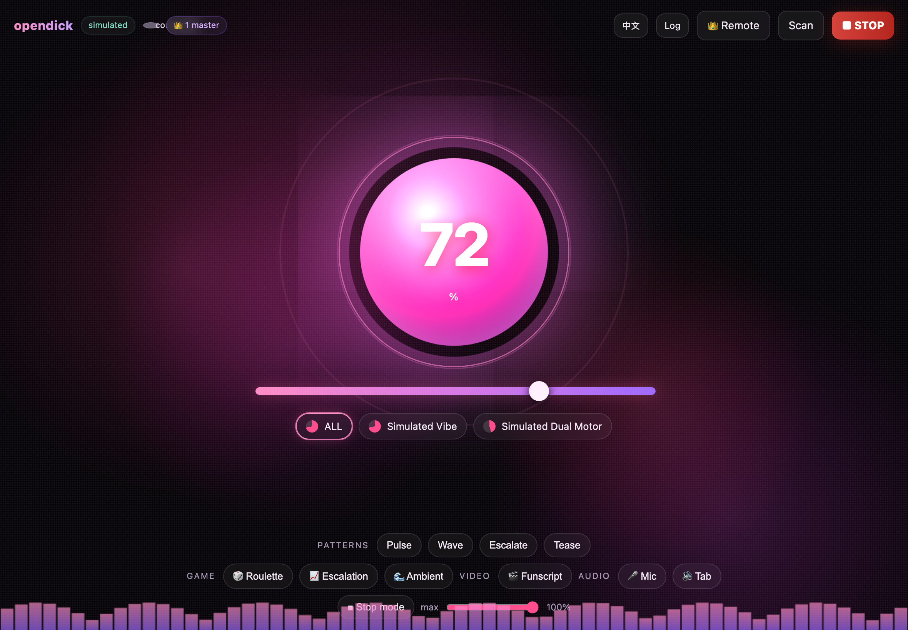
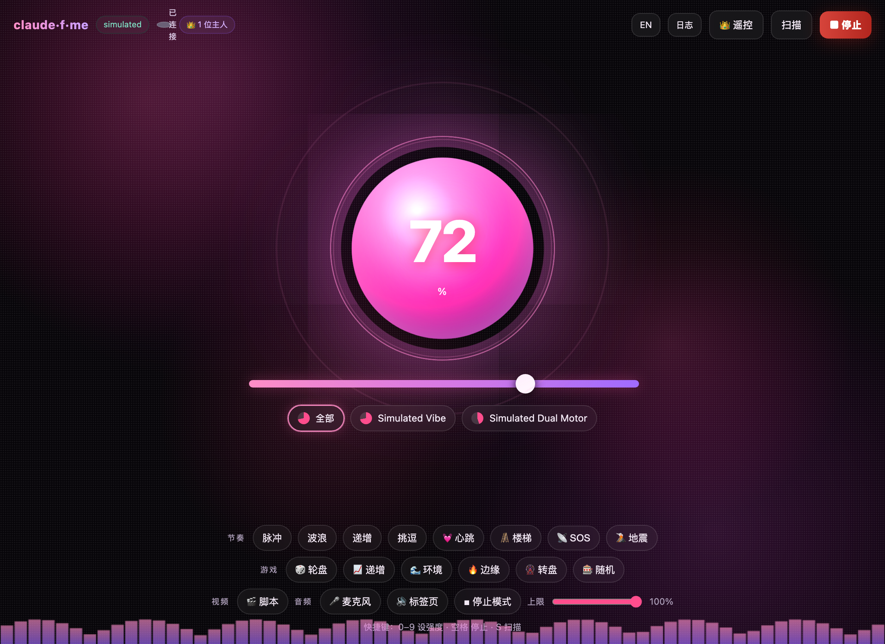
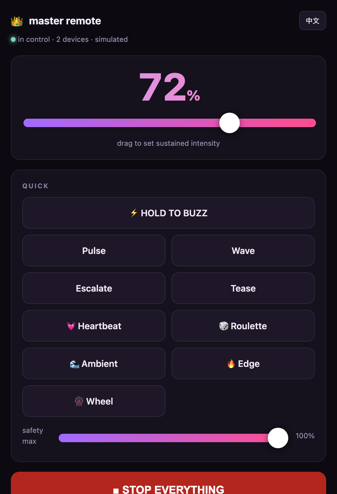

<div align="center">

# claude-f-me

**在 Claude Code 里用「聊天」控制情趣硬件。**

一个可安装的 [Claude Code](https://claude.com/claude-code) 插件，把自然语言对话变成真实设备控制——
底层是开源的 [Buttplug / Intiface](https://buttplug.io) 生态（支持 750+ 款设备），配一个会随强度
实时反应的双语 Web 控制台、主人遥控页，以及 Muse 作曲、人格、双人、视频、游戏、音频等模式。
内置**模拟设备**，**零硬件**也能完整体验。

[](https://modelcontextprotocol.io)
[](https://buttplug.io)
[](../../LICENSE)

<p align="center"><a href="../../README.md">English</a> · <b>简体中文</b> · <a href="README.zh-TW.md">繁體中文</a> · <a href="README.ja.md">日本語</a> · <a href="README.es.md">Español</a> · <a href="README.fr.md">Français</a></p>



</div>

---

> [!IMPORTANT]
> 这控制的是**真人身上的物理设备**。务必在佩戴者**热情、持续同意**的前提下使用。把安全上限设得
> 合理、优先用短时长、把紧急停止放在随手可及处。详见 [安全与同意](#-安全与同意)。

## 截图

| 反应式控制台（英文） | 控制台（中文） | 主人遥控 |
|---|---|---|
|  |  |  |

## 它是什么

一个进程**同时**是 Claude 对话用的 MCP 服务，**和**你盯着看的 Web 控制台——所以聊天和面板始终
共享同一份设备状态。

- 🔌 **真实硬件**：通过 [Intiface Central](https://intiface.com) 驱动 Lovense、We-Vibe、Kiiroo、The Handy、Satisfyer 等 [750+ 款设备](https://iostindex.com)。
- 🎼 **Muse 作曲模式**：模型来**作曲**——你描述一个 vibe（"10 分钟坦陀罗式慢炖"、"一场雷暴"、"用摩斯电码说我爱你"），它写出一条平滑的触感曲线并播放。可存进曲库反复播放。设备变成 AI 演奏的乐器。
- 🎭 **人格**：选择**由谁掌控**——按 SOTA 模型原型设计的驱动人格：🕯️ 慢炖(Opus)、😈 小恶魔(GPT-5.5)、🎼 节拍器、⛈️ 风暴、🔮 神谕、🍼 妈咪。各自改变手感（节奏/混乱度/拒绝倾向/上限）。**盲选模式**藏起是谁——神秘掌控者。
- 💞 **双人模式**：两台控制台用房间码通过内置中继连起来，伴侣的输入实时驱动你的设备（镜像/主导/跟随），带在线状态和 👋 触碰手势。
- ⚡ **「脉动核心」反应式界面**：呼吸发光的能量球 + 极光背景随强度实时放大/发光，外加实时音波。
- 👑 **主人遥控**：手机友好的 `/master` 页面，让另一个人实时接管控制——大旋钮、按住震动、预设、急停。每个页面都会显示有几位主人在控制。
- 🎬 **视频模式**：实时播放 [Funscript](https://github.com/FredTungsten/ScriptPlayer/wiki/Funscript) 时间轴（位置 `0..100` → 强度）。内置示例一键试玩，**或选本地视频+脚本，边看边完美同步**——暂停/拖动/倍速都自动跟上。
- 🔌 **通用事件 webhook**：`POST /event` 端点，让任何东西（Stream Deck、IFTTT、Home Assistant、游戏 overlay、CV 脚本）都能驱动设备（`vibrate`/`pattern`/`game`/`stop`…）。
- 📈 **市值模式**：报上公司名或代码（`特斯拉`、`AAPL`、`比特币`），它拉取实时行情，把涨跌变成**震动旋律**——波动越大越强，绿涨=上行琶音、红跌=下行。大概是唯一一个会对你持仓做出反应的情趣玩具。*(非投资建议。)*
- 🎮 **游戏模式**：`轮盘`、`递增`、`环境`、`边缘`（挑逗-拒绝）、`转盘`（旋转停留），还有 `game_event` 钩子让 Claude 在文字冒险里即时反应。
- 🎵 **音频模式**：用**麦克风**或**标签页/系统声音**实时驱动强度。
- 🥁 **节奏库**：`脉冲`、`波浪`、`递增`、`挑逗`、`心跳`、`楼梯`、`SOS`、`地震`。
- 🧠 **记忆**：本地记忆，学习你的偏好、人格亲和度和"软不喜欢"信号（`remember`/`recall`/`forget`），越用越懂你——且绝不外传。
- 💓 **生物反馈**：在控制台用 Web Bluetooth 直连蓝牙心率带/手表，让心率驱动强度——或**自动边缘**：心率冲过临界就断电，等你平复再续。和身体的真闭环。
- 🎬 **会话录制**：把设备实际发生的一切（手动、双人、音频、生物反馈、游戏）录成一条 Muse 曲子，命名后存进曲库可重播、可分享。一个 ⏺ 把此刻变成收藏。
- 🧑‍💻 **开发者触发**：最「Claude Code plugin」的功能——从你的开发流驱动它。`/dev` 端点 + 内置 🍅 番茄钟奖励：CI 通过、commit、合并或专注满 25 分钟都能让它响。（红色构建什么手感你自己想。）
- 📜 **场景提示词**：现成的引导场景，做成 MCP prompts——妈咪场景、边缘控制、剧情模式、作曲一个 vibe、事后温存。
- 💬 **聊天桥接**：可选 **Telegram** 机器人和**微信公众号**端点——在你天天用的聊天软件里用消息或 emoji 控制（异地伴侣神器）。
- 🌐 **双语**：控制台与遥控页支持**中英文**，一键切换（或 `?lang=zh`）。
- 🛟 **内置安全**：全局上限、每条指令自动急停、看门狗、随处可急停、退出即关停。

## 安装（作为 Claude Code 插件）

```bash
# 1. 把本仓库添加为插件市场
/plugin marketplace add mana-am/claude-f-me

# 2. 安装插件
/plugin install claude-f-me@claude-f-me
```

装完即可在对话里说：

```
扫描设备
以 40% 震动 3 秒
跑一遍 heartbeat 节奏
开始 edge 游戏
作一段 5 分钟、先 edge 两次再释放的曲子
切换成小恶魔人格
给我个惊喜
```

控制台地址 **http://localhost:8731**——用 `/claude-f-me:console` 打开。

### Slash 命令

| 命令 | 作用 |
|---|---|
| `/claude-f-me:console` | 在浏览器打开控制台 |
| `/claude-f-me:demo` | 跑一段「扫描→震动→节奏→游戏」演示 |
| `/claude-f-me:fuck` | 开始（自动扫描，然后逐渐升强） |
| `/claude-f-me:harder` / `:softer` | 增强 / 减弱（±20%） |
| `/claude-f-me:edge` / `:tease` | 边缘控制 / 挑逗节奏 |
| `/claude-f-me:muse` | 从一个 vibe 作一段自定义触感曲子 |
| `/claude-f-me:persona` | 选择由谁掌控（慢炖 / 小恶魔 / …） |
| `/claude-f-me:surprise` | 随机来一个 |
| `/claude-f-me:safeword` · `:panic` | **立即全部停止** |

## 接入真实设备

claude-f-me 以真机为先，模拟器只是预览。

1. 安装并打开 **[Intiface Central](https://intiface.com)** → 点 **Start Server**（默认 `ws://127.0.0.1:12345`）。
2. 在 Intiface 里配对设备并确认出现。Lovense 最好买、支持最好。
3. 把 **`CFM_MODE` 设为 `buttplug`**（编辑 [`.mcp.json`](../../.mcp.json) 的 `env`，或独立运行时导出环境变量）。

> 插件默认 `simulated`，开箱即跑。Node 22+ 自带全局 `WebSocket`；更老的 Node 用 `ws` 兜底，所以真机模式在 Node 18+ 都能用。

### 还没有硬件？预览模式

```bash
git clone https://github.com/mana-am/claude-f-me
cd claude-f-me && npm install && npm run build
npm run console        # 打开 http://localhost:8731
```

点 **Scan**、拖能量球、放节奏/游戏、载入示例脚本、开 **音频**、按 **STOP**——模拟马达会在屏幕上实时反应。键盘：`0–9` 设强度、`空格` 停止、`S` 扫描。

## 👑 主人遥控

打开控制台点 **👑 遥控**（或访问 `/master`）。一个手机大小的专注遥控——大旋钮、按住震动、节奏/游戏快捷键、安全上限、全宽停止键。持有者会被计为**主人**，每个页面都会显示 `👑 N 位主人在控制`。

要给**不在同一台机器**的人用，把控制台端口通过隧道暴露（如 `cloudflared tunnel --url http://localhost:8731` 或 `ngrok http 8731`），分享 `/master` 链接即可。隧道是 HTTPS，`wss://` 会自动生效。

> 只把控制权交给佩戴者信任并同意的人。安全上限和佩戴者自己的 STOP 永远优先。

## 模式与玩法

**🎼 Muse（作曲）**——模型把一句自然语言 brief 变成平滑的关键帧曲线（`{at, level}`，插值）并播放。可在对话里用 `compose` 工具作曲，或在配了外部模型 key 时用控制台的**「描述一个 vibe」**框。曲子可存进曲库（含内置），用 `muse_list` / `muse_play` 重播。

**🎭 人格**——一种驱动性格，调制每个游戏/事件（节奏/混乱/拒绝/上限），并在有对应 key 时决定由哪个模型作曲：🕯️ `slowburn`(Opus) · 😈 `brat`(GPT-5.5) · 🎼 `metronome` · ⛈️ `storm` · 🔮 `oracle` · 🍼 `mommy`。`set_persona blind` 藏起选择直到 `reveal_persona`。

**💞 双人**——打开控制台 **Duet** 面板，分享中继 URL + 房间码，两台控制台通过内置 `/relay` 中继连起来。选 **镜像**（互相感受）、**主导**（你来驱动）或 **跟随**（你来接收）；可发 👋 触碰。收到的强度仍过你本地安全上限。

**🎬 视频（funscript）**——实时播放 `{at,pos}` 时间轴（`循环`/`速度`/`反向`），可一键载入示例。或在 **🎬 脚本** 弹窗里粘贴/载入脚本，选一个**本地视频文件**点 **▶ 配视频播放**——浏览器播视频、按 `video.currentTime` 驱动设备，暂停/拖动/倍速都完美同步（不上传，全本地）。

**🎮 游戏**——轮盘（随机突发）· 递增（爬升保持）· 环境（有机波动）· 边缘（爬到边缘后拒绝，峰值逐轮升高）· 转盘（旋转后停留）。

**🥁 节奏**——脉冲 · 波浪 · 递增 · 挑逗 · 心跳 · 楼梯 · SOS · 地震。

**🎵 音频**——麦克风或标签页声音按响度驱动强度，带灵敏度滑块。

**💓 生物反馈（心率）**——点控制台 **💓 心率** 配对标准蓝牙心率带/手表（Web Bluetooth，需 Chrome/Edge 且在 `localhost` 或 HTTPS 下）。范围自动校准后，**跟随**把心率映射成强度，**自动边缘**则在心率冲过临界时断电、平复后再续。真闭环。

**🎬 会话录制**——点 **⏺ 录制** 把设备实际发生的一切（任意驱动来源——滑块、双人、音频、生物反馈、游戏）录成一条 Muse 曲子；停止时命名即存进曲库，可重播/分享。（不足约 1 秒的录制会被丢弃。）

## 🧠 记忆

可选的本地记忆，让 claude-f-me **越来越懂你**。它记录你常玩的游戏和 Muse 曲子、和哪个人格合拍、以及**软不喜欢信号**（刚开始几秒就被停掉的），还有你写的笔记。Claude 可在作曲或升强前 `recall`，`forget` 一键清空。

- 工具：`remember "喜欢 60% 的心跳"` · `recall` · `forget`
- 存于 `~/.claude-f-me/memory.json`——**仅本地、绝不外传**，就是一份你能读能删的 JSON。

## 📜 场景提示词

引导场景做成 **MCP prompts**——在 Claude Code 里用 `/mcp__claude-f-me__<名字>` 触发：

| prompt | 设定 |
|---|---|
| `mommy-scene` | 扮演 🍼 妈咪人格同时驱动设备 |
| `edge-session` | 带中途确认的结构化挑逗-拒绝 |
| `story-mode` | 选择驱动设备的互动文字冒险 |
| `compose-vibe` | 把一段描述变成 Muse 曲子并播放 |
| `aftercare` | 温柔舒缓的事后收尾 |

## 💬 聊天桥接 — Telegram

在你天天用的聊天软件里控制——异地伴侣绝配。配好 bot token 即自动启动：

```bash
# token 来自 @BotFather；强烈建议用 allow-list 限定可控制的 chat id
export CFM_TELEGRAM_TOKEN=123456:ABC...
export CFM_TELEGRAM_ALLOW=11111111,22222222
```

然后给 bot 发消息：数字 `0–100`、`harder`/`softer`、`stop`/`safeword`、`scan`，或 emoji——🔥边缘 · 💓心跳 · 🌊环境 · 🎡转盘 · 📈递增 · 🎲随机 · 🛑停止。回复中英自动识别。不设 allow-list 的话，任何找到 bot 的人都能控制，所以**一定要设**。安全上限和 `safeword` 永远优先。

## 💬 聊天桥接 — Discord

一个 Discord 机器人（极简 Gateway 客户端，不依赖 discord.js）——私聊它或在频道里用。

```bash
# token 来自 开发者门户 → Bot（开启 "Message Content Intent"）
export CFM_DISCORD_TOKEN=...
export CFM_DISCORD_ALLOW=<你的用户id>,<频道id>   # allow-list，务必设置！
```

词汇和 Telegram 一致：`0–100`、`harder`/`softer`、`stop`/`safeword`、`scan`，或 🔥💓🌊🎡📈🎲。无关消息保持沉默，忽略自己/其他机器人的消息。

## 💬 聊天桥接 — 微信（公众号）

用**合规的方式**从微信双向控制——走官方**公众号**消息回调。我们刻意不碰个人微信网页协议（itchat/wechaty 那类）：违反微信 ToS、易封号。

```bash
export CFM_WECHAT_TOKEN=你在公众号后台设的Token
export CFM_WECHAT_ALLOW=openid1,openid2   # 可选：按 OpenID 限定谁能控制
```

然后在**公众号后台 → 设置与开发 → 基本配置 → 服务器配置**把 URL 填成 `https://<你的公网域名>/wechat`（本地运行，需 frp/cloudflared 之类隧道）。端点会处理 GET 签名握手并被动回复文字/emoji（`0–100`、`harder`/`softer`、`stop`、`扫描`、🔥💓🌊🎡📈🎲）；语音消息回一段心跳。

> **个人微信**仍无官方机器人 API——别用灰产协议。只发通知/团队告警用**企业微信群机器人 webhook** 更简单，但收不到回复；要双向控制就走上面的公众号路线。

## 🧑‍💻 开发者触发

从开发流驱动设备——本地 `/dev` 端点，git hook、CI 步骤、番茄钟或 shell 别名都能打。事件→反应（仍过安全上限）：`commit`/`push`→脉冲 · `ci_pass`/`merge`/`focus_done`→奖励 🎉 · `ci_fail`→SOS · `distracted`→停止。端口非仅本机时设 `CFM_DEV_SECRET` 要求 `secret=`。

```bash
curl -fsS localhost:8731/dev -d event=ci_pass
# git: .git/hooks/post-commit （chmod +x）
curl -fsS localhost:8731/dev -d 'event=commit&magnitude=0.5' >/dev/null 2>&1 || true
```

控制台还内置 **🍅 专注 25 分钟** 番茄钟，计时完成触发 `focus_done`（奖励）。

## 🔌 通用事件 webhook

一个任何东西都能戳的端点——把 Stream Deck 按钮、IFTTT / Home Assistant 自动化、Tasker、游戏 overlay 或 CV 脚本指向 `POST /event`：

```bash
curl -fsS localhost:8731/event -d 'action=vibrate&intensity=0.6&duration_ms=3000'
curl -fsS localhost:8731/event -d 'action=pattern&name=heartbeat'
curl -fsS localhost:8731/event -d 'action=game&type=edge'
curl -fsS localhost:8731/event -d 'action=event&kind=reward&magnitude=0.8'
curl -fsS localhost:8731/event -d 'action=stop'
```

动作：`vibrate`(`intensity`/`duration_ms`) · `pattern`(`name`/`loops`) · `game`(`type`) · `event`(`kind`=reward/penalty/tease/pulse, `magnitude`) · `stop` · `scan`。可选密钥 `CFM_EVENT_SECRET`（回退到 `CFM_DEV_SECRET`）。一切仍过安全上限。

## 📈 市值模式

感受市场。报上公司名或代码，它拉取实时行情（Yahoo Finance → Stooq → Coinbase 回退，无需 key），把当日涨跌变成震动旋律：波动幅度决定强度，绿涨播**上行**琶音、红跌播**下行**。

- 对话里：`market_mode`，`symbol`（`特斯拉`/`AAPL`/`比特币`/`BTC-USD`），可选 `interval_ms`(≥5000)、`duration_ms`、`intensity_max`。`stop_mode` / `emergency_stop` 结束。
- 控制台：在 **📈 市值** 框输代码，点 **感受它**。
- 常见名字（苹果/特斯拉/英伟达/比特币…）自动解析成代码。

> 在你本机轮询、过安全上限、最快 5 秒一次。非投资建议。

## MCP 工具

| 工具 | 说明 |
|---|---|
| `list_devices` | 设备、强度、电量、模式、上限、控制台 URL、活动模式、主人数 |
| `scan_devices` | 扫描 `duration_ms` 后返回列表 |
| `vibrate` | `intensity` 0..1，`target` id/`all`，可选 `duration_ms`（自动停） |
| `pattern` | `preset`(pulse/wave/escalate/tease/heartbeat/staircase/sos/earthquake) 或 `steps`、`loops` |
| `stop` | 停止某设备/`all`，取消其节奏 |
| `emergency_stop` | 立即停止**所有**设备与模式 |
| `set_max_intensity` | 全局安全上限 0..1 |
| `load_funscript` · `play_video` | 载入 + 播放 funscript（`loop`/`speed`/`invert`） |
| `start_game` | `roulette`/`escalation`/`ambient`/`edge`/`wheel`（`intensity_max`、`duration_ms`） |
| `market_mode` | 用实时股票/加密行情驱动（`symbol`、`interval_ms`、`duration_ms`、`intensity_max`） |
| `game_event` | 一次性 `reward`/`penalty`/`tease`/`pulse`，给剧情用 |
| `compose` | 你写 `keyframes`(`[{at,level}]`) 配 `brief` 并播放；可 `save_as`、`loop` |
| `muse_list` · `muse_play` | 列出 / 重播 曲库 |
| `list_personas` · `set_persona` · `reveal_persona` | 选驱动人格（或 `blind`）并揭晓 |
| `remember` · `recall` · `forget` | 本地记忆：存笔记/偏好、调出画像、清空 |
| `stop_mode` | 停止当前 视频/游戏/muse 模式 |

另有 **MCP prompts**（`/mcp__claude-f-me__…`）：`mommy-scene`、`edge-session`、`story-mode`、`compose-vibe`、`aftercare`。

> 音频、生物反馈、会话录制、主人遥控、双人都活在控制台（需浏览器采麦克风/蓝牙/手动操作）；Telegram 桥、微信 `/wechat` 回调、`/dev` 开发者端点跑在服务端；其余都能被 Claude 通过上面的工具驱动。

## 配置

| 环境变量 | 默认 | 含义 |
|---|---|---|
| `CFM_MODE` | `simulated` | `simulated` 或 `buttplug` |
| `CFM_CONSOLE_PORT` | `8731` | 控制台端口（也供 `/master`） |
| `CFM_MAX_INTENSITY` | `1.0` | 初始安全上限（0..1） |
| `CFM_INTIFACE_URL` | `ws://127.0.0.1:12345` | Intiface 服务（buttplug 模式） |
| `ANTHROPIC_API_KEY` / `CFM_LLM_API_KEY` | — | *可选*——让控制台「描述 vibe」框由 **Claude** 作曲 |
| `OPENAI_API_KEY`(+ `CFM_OPENAI_BASE_URL`) | — | *可选*——同上，走 OpenAI 兼容模型（如 GPT 人格） |
| `CFM_TELEGRAM_TOKEN` | — | *可选*——启用 Telegram 桥（@BotFather 拿 token） |
| `CFM_TELEGRAM_ALLOW` | — | 允许控制的 chat id（逗号分隔，务必设置！） |
| `CFM_DISCORD_TOKEN` | — | *可选*——启用 Discord 桥（开启 Message Content Intent） |
| `CFM_DISCORD_ALLOW` | — | 允许控制的 用户/频道 id（逗号分隔，务必设置！） |
| `CFM_WECHAT_TOKEN` | — | *可选*——启用微信公众号端点 `/wechat`（公众号后台拿 token） |
| `CFM_WECHAT_ALLOW` | — | 允许控制的 OpenID（逗号分隔） |
| `CFM_DEV_SECRET` | — | *可选*——给 `/dev` 开发者端点要求 `secret=` |
| `CFM_EVENT_SECRET` | — | *可选*——给 `/event` webhook 要求 `secret=`（回退到 `CFM_DEV_SECRET`） |

> 模型 key **可选**。没有它 Muse 照样能用——在对话里让 Claude `compose` 即可，人格也仍在本地调制手感。有 key 时，人格的 `model` 决定由谁作曲（这就是「🕯️ Opus」对「😈 GPT-5.5」的具体含义）。key 只从环境读取、绝不落盘；双人中继无需 key。

## 开发

```bash
npm run dev          # MCP + 控制台，watch（tsx）
npm run build        # 类型检查 + 产出 dist/（tsc）
npm run bundle       # 自包含 dist/claude-f-me.mjs（esbuild，给插件用）
```

## 🛟 安全与同意

这是真人身上的硬件，设计已尽力，但**你**是最后一道防线：

- **全局强度上限**钳住一切（工具 / 控制台滑块 / 主人遥控）。
- 每条 `vibrate` 都装了**自动停止**；即使不给时长也有 5 分钟硬上限，连续驱动（节奏/视频/游戏/音频）有看门狗，几秒内自动停。
- `emergency_stop` / `/claude-f-me:safeword` / 控制台红色按钮 / 主人的 STOP 都能立刻全停。
- 进程退出时自动关停硬件。

务必在知情、热情、可随时撤回的同意下使用。不要记录或上传使用数据。你为自己的使用方式负责。

## 路线图 / 想法

它要去往哪里——欢迎 PR 和意见：

- 🏆 **排行榜、成就与挑战**：个人统计（场次、总时长、**最长 edge 坚持**、最佳连胜）、可解锁成就，以及**可选加入、匿名**的社区榜单 + 每日/每周挑战（如「撑过 5 分钟 edge」）。异地情侣连胜。隐私优先：仅自愿加入、不含内容、匿名昵称。
- 🌍 **公开控制模式**：可分享的公开房间（主人遥控开放给多人），让观众或直播弹幕共同驱动设备——直播式「打赏/投票控制」、实时人群旋钮、排队轮流。配硬护栏：强制低上限、房主**踢人/暂停/锁定**、每观众冷却、常驻安全词、一键「转私密」。同意与管控优先——公开意味着佩戴者主动开启、可随时撤回。
- 🧩 **分享曲子与节奏**：用短码导出/导入 Muse 曲子和 funscript——一个小小的 vibe 社区库。
- 🗣️ **人格语音**：可选 TTS，让人格真的「说」出台词（🍼「乖宝宝…」）。
- 🎮 **游戏与直播联动**：对游戏或直播事件做出反应（死亡、胜利、打赏）。
- 🐾 **宠物模式（agent 输出速率）**：接入编程 agent——**Codex** 或 Claude Code——用它的**实时输出速率**驱动强度：token 狂飙＝调高，卡住或红色构建＝回落。把生产力变成奖励闭环。把 🧑‍💻 开发者触发从离散事件扩展成连续信号（tail agent 输出流→tokens/秒→强度，当然过安全上限）。
- 🔐 **加密、PIN 锁记忆**：用密码锁住本地记忆和控制台。
- 🧠 **记忆 → 行为**：现在记忆只「记录」+ Claude 可「调出」；下一步让它自动影响人格/Muse 选择、规避不喜欢的组合。
- 💬 **更多聊天桥**：**Discord**（官方 bot，最自然的下一个）、Slack；**WhatsApp** 走 Business API。**微信**无官方个人号 bot API，只有非官方/灰产协议（违反 ToS、易封），故意不做；企业微信可行但笨重。
- 🖥️ **控制台面板**：记忆画像、人格选择器、Muse 曲库（目前靠工具/对话驱动）。
- 👩 **「老板键」隐蔽模式**：一键瞬间静音 + 把控制台伪装成无害界面（区别于 🍼 妈咪*人格*）。
- ⏰ **定时撩**："早安"场景与定时惊喜。
- 🎲 **群控**：多人共控一台设备的房间（真·命运轮盘）。
- 🗣️ **语音条 → 音频模式**：用一条语音消息驱动强度，而不只是实时麦克风。

## ⭐ Star 趋势与贡献者

如果它让你（或别的什么）开心了，点个 ⭐ 真的很有帮助。

[](https://star-history.com/#mana-am/claude-f-me&Date)

[](https://github.com/mana-am/claude-f-me/graphs/contributors)

> Star 趋势图与贡献者地图需在仓库设为**公开**后才会显示。

## 致谢

基于 [Nonpolynomial](https://nonpolynomial.com) 的开源 [Buttplug](https://github.com/buttplugio/buttplug) 协议与 [Intiface](https://intiface.com)，与其无隶属关系。

## 许可

[MIT](../../LICENSE) © SimonAKing
